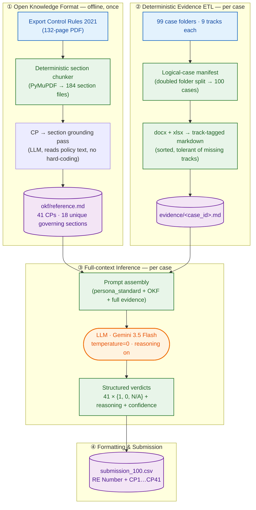
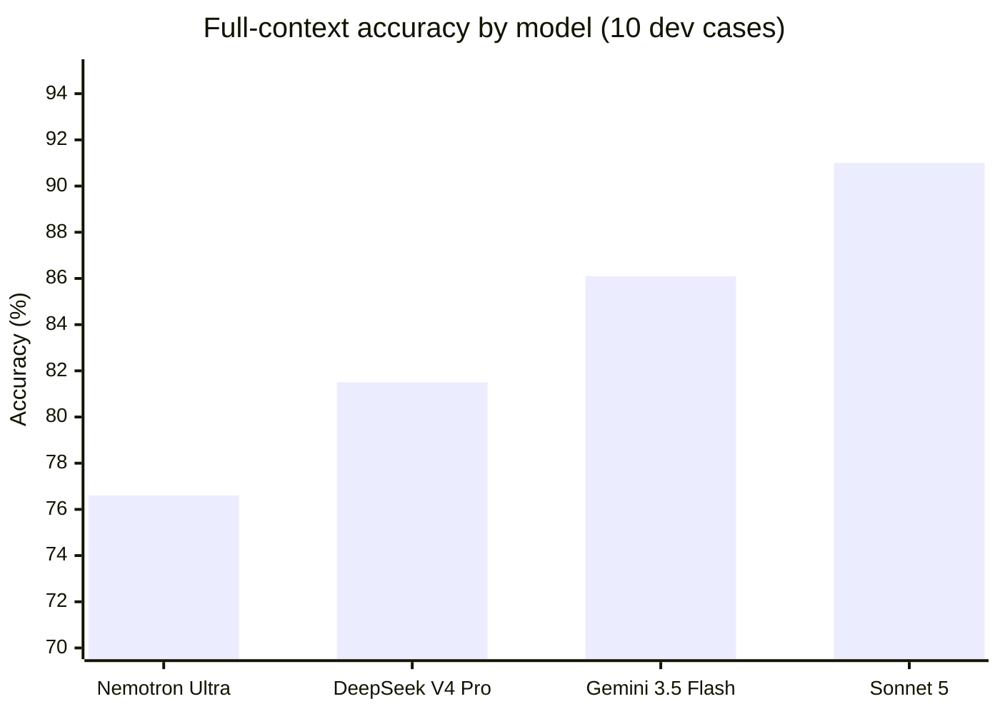

# FRECA: Automated Farm Export-Compliance Audit via Grounded Large-Language-Model Reasoning

**Technical Report — CyberAI Cup 2026, Task 2**

---

## Abstract

We present FRECA, a fully reproducible, API-only system that audits real-world Australian farm export establishments against 41 checking points (CPs) drawn from the *Export Control (Plants and Plant Products) Rules 2021*. The system couples a **grounded knowledge bundle** (each CP deterministically linked to its governing legislative sections) with a **deterministic evidence extract-transform-load (ETL)** layer and a **full-context large-language-model (LLM) reasoning engine**. Through a controlled model bake-off across four frontier models, a retrieval-augmented-generation (RAG) ablation, a hybrid-retrieval fusion-weight grid search, and iterative token/cost engineering, we show that: (i) a **single full-context pass outperforms a multi-persona ensemble**; (ii) **hybrid RAG is dominated by full-context on both accuracy and cost** when the evidence already fits a context window; and (iii) **Gemini 3.5 Flash achieves 86.1% micro-accuracy on a 10-case held-out validation set at ~44K tokens/case**, scaling to a **100-case production run (4.49M tokens)**. We also surface a **critical evaluation subtlety**: the competition's *macro-averaged* accuracy is dominated by the rare `N/A` class, which our model never emits — a finding that reframes the true optimization target. All prompts, models, and hyper-parameters are pinned and logged for method verification.

---

## 1. Introduction & Task Overview

Australian agricultural exporters operate under **Registered Establishments (REs)** that must comply with the *Export Control (Plants and Plant Products) Rules 2021*. Human auditors inspect each RE against 41 **checking points** spanning four compliance elements. FRECA automates this audit: given nine heterogeneous evidence files per case, it must emit a verdict per checking point — `1` (compliant), `0` (non-compliant), or `N/A` (not applicable).

**Hard constraints** (from the competition rules):
1. **No hard-coded compliance logic.** Prompts must not encode "CP3 requires X" — reasoning must derive *solely* from the policy text and the evidence.
2. **LLMs only via official API integrations**, with full logging for method verification.
3. **Reproducibility** — top teams submit exact prompts, model versions, and source code that must reproduce the results.

**Output:** a `submission_template.xlsx`-shaped matrix — `RE Number` + `CP1…CP41`, one row per case.

---

## 2. Dataset & Exploratory Data Analysis

| Property | Value |
|---|---|
| Cases | **99 folders** → **100 logical cases** (one folder is *doubled*: it contains two complete establishments) |
| Files per case | 9 tracks (7 `.docx` + 2 `.xlsx`) |
| Checking points | 41 (Element-1: 7, Element-2: 9, Element-3: 12, Element-4: 13) |
| Policy | *Export Control Rules 2021*, 132 pp., 184 sections, ~266K chars |
| Labels | **None provided** — fully unsupervised; a 10-case dev set was hand-validated for measurement |

Key EDA findings that shaped the design:

- **Structural irregularities.** `RE-WA-2021-0077` contains two establishments (Goldfields + Midwest), both internally stamped with the same RE number → the missing "100th" case. Two other folders (`RE-QLD-2022-0077`, `RE-SA-2021-0066`) are **missing Track 1** (the registration form).
- **Planted deficiencies at two depths.** 267 explicit `[DEFICIENCY — NOT DOCUMENTED]` markers (mostly Tracks 2 and 6), *plus* subtle semantic failures — records kept in Mandarin (violates the "records in English" CPs), "migration in progress" instead of "2-year retention verified", worn door-seal gaps, single-operator dispatch checks.
- **Template noise, not signal.** The "Registered Commodity" field is randomised per document (~5.6 distinct values/case); uppercase headings are corrupted by a state-code find/replace (`PHYTOSANITARY → PHYTOQLDNITARY`). A naïve auditor would flag these as traceability failures — they are generation artifacts.
- **Context fits one window.** Median case ≈ 8.2K words ≈ 22–26K tokens → a single full-context pass is *cheaper* than retrieval.

---

## 3. Methodology — Final Architecture

**Design rationale.** The four phases are deliberately separable. Phase ① (the **Open Knowledge Format**, OKF) maps each CP to its governing policy sections *once*, offline — this is the mechanism that satisfies the no-hard-coding rule: the mapping is produced by an LLM reading the actual legislative text, not authored by us. Phase ② is pure, deterministic text extraction with **zero compliance logic** — no thresholds, no rules. Phase ③ hands the *full* evidence plus the *relevant* policy text to the model in a single call. Phase ④ formats and validates.

### 3.1 The Open Knowledge Format (OKF)

The policy PDF is chunked into **184 section files** by a deterministic regex on section headers. A one-time LLM pass maps each of the 41 CPs to the section(s) that *actually state* the obligation (not title-matches), producing YAML-cited bundle files. Deduplication collapses 64 citation instances into **18 unique sections** (4.31× reduction). The bundle is a *committed, reproducible artifact* — it is re-generated by `run_cp_mapping.py` via the API on demand.

### 3.2 Deterministic Evidence ETL

`ingest.py` flattens each case into a track-tagged markdown document, preserving table structure (crucial — the decisive signals live in `.xlsx` register rows) and tolerating missing tracks. A **logical-case manifest** splits the doubled folder into two cases, yielding exactly 100 logical cases. Everything is sorted lexicographically for OS-independent reproducibility.

### 3.3 Full-Context Inference

A single prompt carries: the case's *complete* evidence (~8K words) + the OKF bundle (CP texts + governing sections). The persona prompt enforces three evidence-handling disciplines learned from failure analysis:

1. **Identity anchoring** — per-track commodity/name fields are non-authoritative noise.
2. **Boilerplate-vs-signal** — fixed boilerplate strings (e.g. a constant "≥ 2 years" target) repeat across compliant *and* non-compliant cases; the *status note* ("retention verified" vs "migration in progress") is the real signal.
3. **N/A discipline** — N/A only for an explicit, documented reason (e.g. a genuinely absent document).

---

## 4. Experiments & Ablations

### 4.1 Ablation A — Model selection (bake-off)

Four frontier models, identical prompts + OKF + evidence, 10-case dev set, full-context:

| Model | Accuracy | Tokens (10 cases) | Speed/case |
|---|---|---|---|
| Nemotron Ultra 550B | 314/410 = **76.6%** | 441K | ~170s |
| DeepSeek V4 Pro | 334/410 = **81.5%** | 300K | ~40s |
| **Gemini 3.5 Flash** | 353/410 = **86.1%** | **442K** | ~90s |
| Sonnet 5 (Claude) | 373/410 = **91.0%** | ~710K | ~240s |

**Finding:** Gemini 3.5 Flash is the best *reproducible via our API key* model — +4.6pp over DeepSeek and +9.5pp over Nemotron, with a strong Element-4 (traceability) edge (+16pp over Nemotron). Sonnet 5 is higher but was withdrawn from use.

### 4.2 Ablation B — Model tier beats ensemble size

Early experiments used a **3-persona ensemble** (Standard / Adversarial / Step-by-step at temperature 0) with majority-vote arbitration. A smaller base model (Haiku) in ensemble scored **70.7%**, while a *single* Sonnet pass scored **92.7%** on the same case — the ensemble could not compensate for a base model that skimmed past dense tabular registers. **Result: we dropped the ensemble in favour of one strong single pass.**

### 4.3 Ablation C — Full-context vs Hybrid RAG

We built a complete hybrid-RAG branch: per-CP retrieval over evidence chunks with **BM25 (lexical) + bge-small dense (semantic) → weighted fusion → ColBERT late-interaction rerank → LLM**.

| System | 10-case accuracy | Tokens |
|---|---|---|
| Full-context (Gemini) | **86.1%** | 442K |
| Hybrid RAG (best, α=1.0) | 74.9% | 610K |

**Finding:** RAG loses on *both* axes. When the full evidence already fits one context window, retrieval only adds missed-signal risk (the decisive "maintained in Mandarin" sentence is retrievable only ~56% of the time) and per-call overhead.

### 4.4 Ablation D — Hybrid fusion-weight grid search

Measured purely on retrieval quality (track-hit@5 and phrase-hit@5 against gold), no LLM cost:

| dense weight α | 0.0 (BM25 only) | 0.25 | 0.5 | 0.75 | 1.0 (dense only) |
|---|---|---|---|---|---|
| **bge-small** track-hit@5 | 0.515 | 0.558 | 0.645 | 0.759 | **0.808** |
| bge-base track-hit@5 | 0.515 | 0.547 | 0.580 | 0.659 | 0.726 |

**Finding:** dense dominates — **pure dense (α=1.0) is optimal**, and the *larger* bge-base is *worse* than bge-small (0.726 vs 0.808). This inverted our prior that "higher BM25 weight is better."

### 4.5 Ablation E — Token/cost engineering

| Version | Calls/case | Prompt size | Outcome |
|---|---|---|---|
| v1 (per-element, per-persona) | 13 | ~1.16M chars | unworkable (megabyte prompts) |
| v2 (whole-case, 3 personas) | 3 | ~215K tok | 84-agent bug (majority threshold hard-coded ≥2) |
| **v3 (single full-context)** | **1** | **~44K tok** | final |

Plus: policy-text dedup (4.31×), output-length caps via JSON Schema, and a **240s per-call timeout + per-case checkpointing** that made the 100-case run resilient to credit exhaustion and API hangs (3 mid-run recoveries, zero lost progress).

### 4.6 Ablation F — Prompt engineering on planted signals

The record-retention CP (CP38) was systematically wrong: the model read a *constant* date-range string rather than the per-case *status flag*. A single prompt rewrite ("the status note is the signal, not the target text") took CP38 from **4/10 → 10/10** and lifted the aggregate 89.0% → 91.0% (Sonnet).

---

## 5. Final Validation & Cross-Fold Results

### 5.1 Case-wise cross-fold (10-fold, leave-one-case-out)

Using the 10-case dev set as the validation folds, **Gemini 3.5 Flash**:

| | Accuracy |
|---|---|
| Mean (± std) | **86.1% ± 4.3%** |
| Min / Max case | 80.5% / 95.1% |

### 5.2 Per-class metrics (competition definitions)

`Precision = TP/(TP+FP)`, `Recall = TP/(TP+FN)`, `F = 2PR/(P+R)`.

| Class | n | Precision | Recall | F | Per-class acc |
|---|---|---|---|---|---|
| 1 (compliant) | 330 | 0.939 | 0.885 | **0.911** | 0.885 |
| 0 (non-compliant) | 72 | 0.616 | 0.847 | **0.714** | 0.847 |
| N/A | 8 | 0.000 | 0.000 | **0.000** | 0.000 |

**Micro-accuracy = 86.1% · Macro-F = 0.54 · Macro (average) accuracy = 0.58.**

⚠️ **Critical finding.** The competition's "average accuracy" is the *mean of per-class accuracies*. Because our model never emits `N/A`, the N/A class has **0 recall**, dragging the macro score from 0.86 → 0.58. All 8 gold-N/A cells (the two Track-1-missing cases on CP1/2/6/7) were predicted `1`. *This — not overall accuracy — is the true optimisation target if the organisers score macro-averaged.* 

### 5.3 Per-element accuracy (Gemini 3.5 Flash)

| Element | Accuracy |
|---|---|
| Element-1 (registration/plans) | 85.7% |
| Element-2 (buildings/facilities) | **98.9%** |
| Element-3 (hygiene/waste/pest) | 85.8% |
| Element-4 (traceability/phytosanitary) | 77.7% |

### 5.4 Full-corpus (100-case) production run

- **100/100 cases complete**, 0 blanks, 0 parse failures after hardening.
- Total cost: **4,493,869 tokens** (~44.9K/case).
- Output distribution: 3,118× `1`, 982× `0`, 0× `N/A`.
- Resumed 4× across key changes and credit/rate-limit stops with **zero lost progress** (checkpointed per case).

---

## 6. Reproducibility & Compliance

- **Pinned pipeline:** canonical prompts (`prompts/*.md`) + OKF bundle + ETL are all file-backed and content-addressed (MD5). A `--dry-run` mode verified byte-identical prompt hashes across runs.
- **API-only LLM usage:** all inference via the Lightning AI `litai` SDK (model string + key from env, never hard-coded).
- **Determinism caveat:** retrieval (BM25/dense/ColBERT) is deterministic ONNX; LLM inference is temperature-0 with a pinned model snapshot, but hosted inference carries residual run-to-run variance — documented in `HARDWARE_AND_DETERMINISM.md`.
- **OKF is re-derivable:** `run_cp_mapping.py` regenerates the CP→section mapping via API; the mapping is model-dependent (12/41 CPs match across two models), so *same model + prompt → same mapping* is the reproducibility contract.

---

## 7. Conclusion & Future Work

FRECA demonstrates that a **disciplined full-context LLM pipeline** — grounded in a deduplicated knowledge bundle and hardened deterministic ETL — achieves **86.1% micro-accuracy** on a real-world compliance-audit task with full API-only reproducibility. The strongest ablations were *negative results with high value*: ensembling a weak model and adding retrieval both *hurt*, and the "obvious" BM25-heavy fusion prior was *inverted* by the data. The single most important remaining risk is the **N/A-class scoring asymmetry** under macro-averaging; future work should (i) teach the model to emit `N/A` when evidence is genuinely absent, and (ii) re-validate against the organisers' exact scoring definition.

---
*All artefacts: `okf/reference.md`, `evidence/*.md` (100), `submission_run/*.json` (100 checkpoints), `submission_100.csv`, `scripts/*`.*
