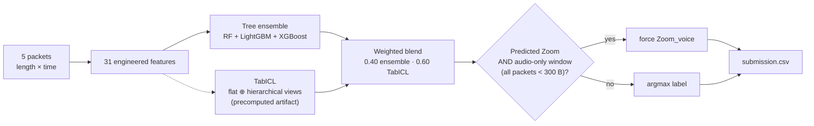

# CyberAI Cup 2026 — Task 3 · Encrypted RTC Application Identification

**Identify the application and call mode of an encrypted real-time-communication flow from the sizes
and arrival times of its first five packets.**

Given five `(relative_time, packet_length)` pairs from an SRTP-over-DTLS encrypted UDP media flow,
predict one of **ten classes** — {Discord, Google Meet, Messenger, WhatsApp, Zoom} × {voice, video}.

| | |
|---|---|
| **Final submission macro-F1** | **0.8318** (10-fold grouped nested CV) |
| Final submission accuracy | 0.8374 |
| Measured task ceiling | 0.9364 macro-F1 / 0.9377 accuracy |
| Training / test flows | 1,285 / 327 |
| Features per flow | 10 (5 sizes + 5 times) |

The submitted model is a **weighted blend** of a light tree ensemble (RandomForest + LightGBM +
XGBoost) and a **TabICL tabular foundation model**, followed by one parameter-free decision rule that
resolves the Zoom voice/video boundary.

> **Why the ceiling is 0.9364, not 1.0:** every record is the *first five packets* of a flow, so a
> video call whose opening packets carry no video fragment is physically indistinguishable from a voice
> call. In the training set this is exact — 160 Zoom flows have audio-only windows, split 80 voice vs
> 80 video at coin-flip discriminability. The remaining 0.10 gap to the ceiling is dominated by that
> subset plus Google Meet.

---

## Final submission

The clean, self-contained, winning pipeline lives in **[`Task-3-CyberAi-Cup/`](Task-3-CyberAi-Cup/)**:

```bash
cd Task-3-CyberAi-Cup
pip install -r requirements.txt
python Final_Blended_model_Task-3.py      # writes submission.csv
diff submission.csv /tmp/check.csv        # bit-identical reproduction
```

It contains the final `submission.csv` (327 rows, no header, `index,label`), the TabICL probability
artifact, the training/test CSVs, and its own README with full run-and-replicate instructions.

The root `submission.csv` is the earlier research-shipped model (TabICL flat⊕hierarchical + Zoom rule,
macro-F1 0.8292) and is **superseded** by the blend in `Task-3-CyberAi-Cup/`.

---

## Architecture (winning pipeline)



The tree ensemble wins `Zoom_voice` recall; TabICL is equal-or-better on every other class; the Zoom
rule is derived (not fitted) from the label geometry. Full diagram in
[`Task-3-CyberAi-Cup/task3_architecture.mermaid`](Task-3-CyberAi-Cup/task3_architecture.mermaid).

---

## Repository map

```
.
├── Task-3-CyberAi-Cup/        ← FINAL WINNING SUBMISSION (runnable, self-contained)
├── REPORT.md                  ← full methodology + results (start here)
├── RESEARCH_PAPER.md          ← research-paper write-up (with 8 diagrams)
├── paper/                     ← compiled LaTeX PDF of the research paper
├── HANDOVER.md                ← code handover + reproducibility tiers
├── ABLATION2.md / ABLATION3.md← every ablation, including the negative ones
├── PLAN.md / PLAN2.md         ← implementation plans + execution log
├── src/                       ← feature engineering, models, analysis, transformer, Modal app
├── scripts/                   ← train.py / predict.py / spawn.py entry points
├── artifacts/                 ← fold indices, model matrices, rendered diagrams
└── experiments/               ← scratch scripts kept as evidence
```

---

## Documentation index

| Document | What it answers |
|---|---|
| [`REPORT.md`](REPORT.md) | Methodology first, then results — the complete record of all three rounds |
| [`RESEARCH_PAPER.md`](RESEARCH_PAPER.md) | Paper-style write-up: abstract, related work, experiments, final architecture, validation |
| [`paper/research_paper.pdf`](paper/research_paper.pdf) | Compiled 21-page LaTeX PDF of the research paper |
| [`HANDOVER.md`](HANDOVER.md) | How the shipped model is built, how to reproduce it, the four reproducibility tiers |
| [`ABLATION2.md`](ABLATION2.md) | Rounds 1–2: foundation models, tuning, probes, call-structure recovery |
| [`ABLATION3.md`](ABLATION3.md) | Round 3: the label geometry, the ceiling, the Zoom rule, the final model |
| [`PLAN2.md`](PLAN2.md) | Phase-2 plan and the research references used |

---

## Key findings, in brief

1. **A tabular foundation model beat 2,377 tuned tree points with zero tuning.** TabICL scored 0.8389
   grouped accuracy against LightGBM's 0.8249 — the single largest gain in the project.
2. **The Zoom voice/video pair is irreducibly ambiguous.** 160 training flows (80/80) are unclassifiable
   from five packets, fixing the task ceiling at 0.9364 macro-F1.
3. **A derived rule, not a fitted one.** "Predicted Zoom + audio-only window → `Zoom_voice`" raised
   macro-F1 for *all six* model families tested, because on an evenly-split inseparable subset the
   choice is free in accuracy but not in macro-F1.
4. **The auxiliary corpus did not transfer.** A MIRAGE-trained classifier scored 0.318 application
   accuracy against a 0.384 majority baseline — the domain gap is total at packet-size level.
5. **Fitted parameters chosen on the same rows they're scored on lie.** The nested blend, fitted
   decision layers, and a 17-candidate maximum each showed in-sample gains that vanished under nested
   re-evaluation.

---

## Reproducibility

The final submission reproduces **bit-identically** from the committed scripts and artifacts
(verified with `diff`). The tree models and features are deterministic and seeded; TabICL's
probabilities are consumed as a precomputed artifact and reproducible to the ±0.003 noise floor.
Full statement in [`HANDOVER.md` §9](HANDOVER.md).

---

## Attribution

Winning solution for **Task 3 of the CyberAI Cup 2026**, hosted by the ICONIP workshop. Built by
Siddhant Parashar.
