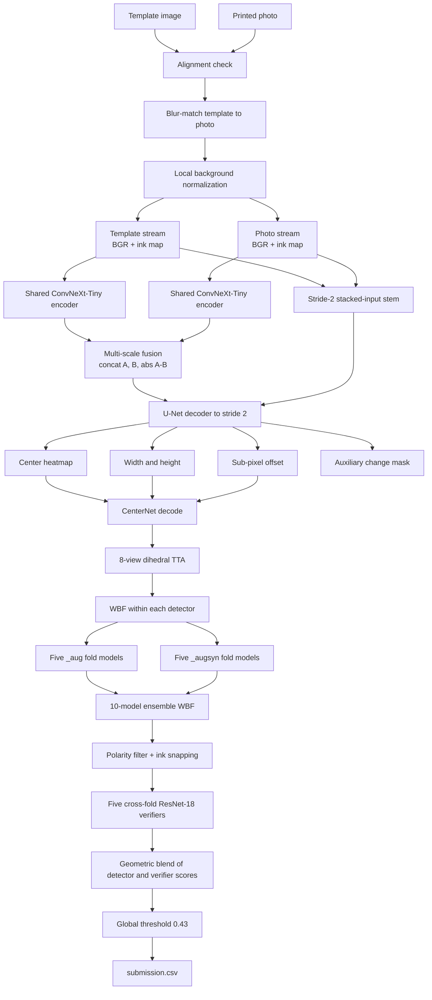

# Packaging Material Difference Mining

End-to-end solution for CyberAI Cup 2026 Task 1: detect semantic differences between a clean
packaging design template and a photographed/printed version, while ignoring printing, blur,
lighting, shadow, compression, and scanning artifacts.

The repository contains the complete pipeline that produced [`submission.csv`](submission.csv):

- preprocessing and image normalization;
- two complementary five-fold detector ensembles;
- fold-safe synthetic data generation;
- leakage-free cross-fold patch verifiers;
- tiled test-time augmentation and Weighted Boxes Fusion;
- global-F1 threshold calibration; and
- Modal infrastructure for preprocessing, training, validation, and test inference.

## Final artifacts and measured result

| Artifact or metric | Value |
|---|---:|
| Pooled 5-fold out-of-fold F1 | **0.9465** |
| Nested-threshold estimate | **0.9435** |
| Precision / recall at pooled threshold | 0.9632 / 0.9303 |
| Pooled TP / FP / FN | 1309 / 50 / 98 |
| Global score threshold used for submission | **0.43** |
| Submission rows | **668** |
| Test images represented | **100 / 100** |
| Predictions per test image | 6.68 |
| `submission.csv` SHA-256 | `319f9be0226200f852b17082e0ffef1e78771fd2e83e1cd46f2510e441a98695` |

The competition metric is global F1. Predictions are greedily matched to previously unmatched
ground-truth boxes at IoU >= 0.5, and TP/FP/FN are accumulated over all images before precision,
recall, and F1 are calculated.

> The reported 0.9465 uses checkpoints selected on each fold's validation history and a threshold
> swept over pooled out-of-fold predictions. A nested threshold audit reduces the estimate to
> 0.9435. See [Overfitting and limitations](#overfitting-and-limitations) before treating the larger
> number as an unbiased estimate of test performance.

## Quickest path: recreate the same submission from the existing weights

This is the appropriate path when the goal is to reproduce the provided CSV rather than retrain
the system. It uses the 10 detector checkpoints and 5 verifier checkpoints already present under
`checkpoints/`.

### 1. Prerequisites

- Python 3.11 or 3.12
- [`uv`](https://docs.astral.sh/uv/)
- a Modal account and authenticated Modal CLI
- the competition dataset unpacked at
  `Task1/PackagingMaterialDifferenceMiningDataset/`
- an account with access to GPUs on Modal

Create the local environment:

```bash
uv venv --python 3.12 .venv
uv pip install --python .venv/bin/python -e . \
  torch torchvision timm opencv-python-headless "numpy<2" pandas
source .venv/bin/activate
```

Confirm Modal authentication:

```bash
modal token info
```

### 2. Create and populate Modal volumes

The Modal app expects two named volumes:

- `pmdm-data`, mounted at `/data`;
- `pmdm-ckpt`, mounted at `/ckpt`.

```bash
modal volume create pmdm-data
modal volume create pmdm-ckpt

modal volume put pmdm-data \
  Task1/PackagingMaterialDifferenceMiningDataset/train /raw/train
modal volume put pmdm-data \
  Task1/PackagingMaterialDifferenceMiningDataset/test /raw/test
```

Upload the exact production checkpoints. The required layout is:

```text
/ckpt/
├── stage1_fold0_convnext_tiny_aug/best.pt
├── stage1_fold0_convnext_tiny_augsyn/best.pt
├── stage1_fold1_convnext_tiny_aug/best.pt
├── stage1_fold1_convnext_tiny_augsyn/best.pt
├── stage1_fold2_convnext_tiny_aug/best.pt
├── stage1_fold2_convnext_tiny_augsyn/best.pt
├── stage1_fold3_convnext_tiny_aug/best.pt
├── stage1_fold3_convnext_tiny_augsyn/best.pt
├── stage1_fold4_convnext_tiny_aug/best.pt
├── stage1_fold4_convnext_tiny_augsyn/best.pt
└── stage2_cv/
    ├── fold0/last.pt
    ├── fold1/last.pt
    ├── fold2/last.pt
    ├── fold3/last.pt
    └── fold4/last.pt
```

Upload them:

```bash
for fold in 0 1 2 3 4; do
  modal volume put pmdm-ckpt \
    "checkpoints/stage1_fold${fold}_convnext_tiny_aug" \
    "/stage1_fold${fold}_convnext_tiny_aug"
  modal volume put pmdm-ckpt \
    "checkpoints/stage1_fold${fold}_convnext_tiny_augsyn" \
    "/stage1_fold${fold}_convnext_tiny_augsyn"
  modal volume put pmdm-ckpt \
    "checkpoints/stage2_cv/fold${fold}" \
    "/stage2_cv/fold${fold}"
done
```

### 3. Preprocess all train and test pairs

```bash
modal run modal_app.py::prep
```

Expected result:

```text
{'pairs': 300, 'align_modes': {'none': 284, 'translate': 16}}
```

The command writes the following for every pair:

```text
/data/work/prep/{train|test}/NNN/
├── t.png   # blur-matched template
├── p.png   # aligned photo
├── tn.png  # template ink map
└── pn.png  # photo ink map
```

### 4. Generate the test submission

```bash
modal run --detach modal_app.py::predict \
  --folds "0,1,2,3,4" \
  --tags "_aug,_augsyn" \
  --flips \
  --score-thr 0.02 \
  --max-boxes 300 \
  --use-verifier \
  --blend 0.5 \
  --threshold 0.43 \
  --n-shards 5
```

Wait for the detached app to finish, then download the generated file:

```bash
modal volume get pmdm-ckpt /submission.csv ./recreated_submission.csv
```

Verify it:

```bash
shasum -a 256 recreated_submission.csv submission.csv
cmp -s recreated_submission.csv submission.csv
echo $?
```

The expected checksum is:

```text
319f9be0226200f852b17082e0ffef1e78771fd2e83e1cd46f2510e441a98695
```

A `cmp` exit code of `0` means the files are byte-for-byte identical.

> GPU inference and floating-point kernels can vary across hardware, PyTorch, CUDA, and cuDNN
> versions. The Modal image pins PyTorch, torchvision, timm, and OpenCV to the versions used by
> this pipeline, making exact reproduction much more likely than running with arbitrary local
> versions.

## Complete system overview



## Why this architecture was chosen

The architecture follows measured properties of the dataset rather than a generic detection
recipe.

| Dataset property | Measurement | Design consequence |
|---|---:|---|
| Pair alignment | residual displacement p95 <= 0.26 px | registration is only a check/fallback, not a learned stage |
| Difference size | median approximately 22x22 px | output stride 2 and native-resolution tiling |
| Very small differences | 419/1407 boxes have both sides below 16 px; 83 are 8x8 | CenterNet offsets, TTA, and coordinate-averaging WBF |
| Change polarity | 842 additions, 558 modifications, 0 pure deletions | reject template-ink/photo-blank candidates |
| Main nuisance | printed photo is softer, noisier, and shadowed | blur matching plus local ink maps |
| Small training set | only 200 labelled pairs | shared encoder, 5-fold ensemble, synthetic pairs, verifier |

### Stage 0: alignment, blur matching, and ink maps

Implemented in [`src/pmdm/preprocess.py`](src/pmdm/preprocess.py).

1. Phase correlation checks whether the photo is already registered to the template.
2. Displacements under 0.5 px are left untouched.
3. Displacements under 8 px use translation; larger cases fall back to ECC Euclidean alignment.
4. The template is blurred with the sigma from
   `[0.0, 0.4, 0.6, 0.8, 1.0, 1.3, 1.6, 2.0, 2.5]` that best matches the photo's Laplacian
   variance.
5. Each image gets an ink map:

   ```text
   ink = clip(GaussianBlur(gray, sigma=31) - gray, 0, 255)
   ```

   This describes how much darker each pixel is than its local background and suppresses smooth
   lighting/shadow changes.

The detector receives two four-channel inputs: `template BGR + template ink` and
`photo BGR + photo ink`, normalized to `[0, 1]`.

### Stage 1: SiamCenterNet detector

Implemented in [`src/pmdm/model.py`](src/pmdm/model.py).

The two streams share a `timm` ConvNeXt-Tiny encoder initialized from ImageNet weights. At encoder
strides 4, 8, 16, and 32, each template/photo feature pair is fused as:

```text
fused = Conv(concat(template_feature,
                    photo_feature,
                    abs(template_feature - photo_feature)))
```

A U-Net decoder combines those fused features with a stride-2 stem built directly from:

```text
[template_4ch, photo_4ch, signed_ink_difference, mean_absolute_BGR_difference]
```

The stride-2 output has four heads:

- `hm`: one-channel Gaussian center heatmap;
- `wh`: width and height in input pixels;
- `off`: sub-pixel center offset;
- `seg`: auxiliary binary change mask.

The output stride is 2 rather than CenterNet's common stride 4 because an 8x8 target would occupy
only 2x2 cells at stride 4, leaving almost no localization tolerance under an IoU 0.5 metric.

### Detector training

Each real image is sampled as overlapping 768x768 tiles; 60% of tiles are centered near an
annotated difference. Horizontal flips, vertical flips, and transposition are sampled
independently, covering the eight-element dihedral group over time. The photo stream also receives
brightness, offset, blur, and Gaussian-noise jitter.

Common optimization settings:

| Parameter | Value |
|---|---:|
| Optimizer | AdamW |
| Maximum learning rate | `3e-4` |
| Weight decay | `1e-4` |
| Schedule | OneCycleLR, `pct_start=0.1` |
| Batch size | 8 |
| Precision | bfloat16 autocast with GradScaler |
| Gradient clipping | 5.0 |
| EMA decay | 0.999 |
| Tile size / stride | 768 / 576 |
| Detector output stride | 2 |

Losses:

```text
L = 1.0 * GaussianFocal(center heatmap)
  + wh_weight * L1(width, height)
  + 1.0 * L1(sub-pixel offset)
  + 0.5 * [BCE + Dice](change mask)
```

The focal and segmentation losses are forced to float32 inside bfloat16 training. Without this,
`1 - 1e-4` rounds to exactly `1.0` in bfloat16, producing `log(0)`, `-inf * 0`, and eventually NaN.

### The two complementary detector recipes

The final submission uses two independently trained model families for every fold.

#### `_aug`: precision-oriented detector

```bash
modal run --detach modal_app.py::train_all \
  --folds "0,1,2,3,4" \
  --epochs 40 \
  --tag _aug \
  --n-synth 0
```

- 160 real training pages per fold;
- 8 tiles per page per epoch;
- 40 epochs, approximately 160 optimizer steps per epoch;
- geometric and photometric augmentation;
- size-relative width/height L1;
- EMA evaluated alongside raw weights;
- checkpoint chosen by validation global F1.

This family supplies most of the ensemble's precision.

#### `_augsyn`: coverage-oriented detector

```bash
modal run --detach modal_app.py::train_all \
  --folds "0,1,2,3,4" \
  --epochs 15 \
  --tag _augsyn \
  --n-synth 1500 \
  --samples-per-pair 2 \
  --real-repeat 4 \
  --eval-every 2 \
  --no-wh-relative
```

- 640 repeated real entries plus 1500 fold-safe synthetic entries per fold;
- 2 tiles per entry, approximately 535 optimizer steps per epoch;
- 15 epochs;
- conventional pixel L1 for width/height with weight 0.2;
- EMA and best-checkpoint selection.

This family has lower standalone F1 but much better candidate coverage for small marks. On fold 0,
sub-12-pixel recall ceiling rose from 0.828 for the original model to 0.922 for `_augsyn`.

### Synthetic data generation

Implemented in [`src/pmdm/synth.py`](src/pmdm/synth.py).

Generate 6400 pairs in 16 deterministic shards:

```bash
modal run --detach modal_app.py::synth \
  --shards 16 \
  --per-shard 400 \
  --small-bias 0.6
```

If shard files exist but `boxes.json` does not, merge them without regenerating images:

```bash
modal run modal_app.py::merge_synth
```

Synthetic edits are swaps, insertions, and new marks. Sixty percent of generated pairs use the
small-object-biased distribution:

```text
edit weights: swap 0.25, insert 0.25, mark 0.50
mark sizes:   4, 5, 6, 6, 7, 8, 8, 9, 10, 11, 12, 14, 16, 20 px
```

The edited image is degraded with a sub-pixel translation, Gaussian blur, smooth shadow fields,
gamma change, Gaussian sensor noise, and JPEG quality 55–95.

#### Leakage prevention for synthetic data

Every synthetic record stores its source split and source template index. For validation fold
`k`, any synthetic pair created from one of fold `k`'s real validation templates is dropped. Pairs
created from test templates are allowed because test labels do not exist; they add layout variety
without exposing any answer. In the production run, this removed 836–892 of 6400 pairs per fold.

### Five-fold split

Implemented in [`src/pmdm/folds.py`](src/pmdm/folds.py).

The 200 training pairs are permuted with NumPy seed 0 and assigned by position modulo 5. Every
fold therefore has 160 training pairs and 40 validation pairs. Out-of-fold predictions for an
image always come from the detector pair that did not train on that image.

### Tiled inference and TTA

Implemented in [`src/pmdm/infer.py`](src/pmdm/infer.py).

- tile size: 768;
- tile stride: 576, giving 25% overlap;
- candidate score floor: 0.02;
- maximum postprocessed candidates per image: 300;
- eight TTA views: horizontal flip x vertical flip x transpose;
- each transformed box is mapped back to original coordinates before fusion.

### Weighted Boxes Fusion

Implemented in [`src/pmdm/decode.py`](src/pmdm/decode.py).

Candidates with IoU >= 0.55 form a cluster. Coordinates are averaged using confidence weights.
For TTA and model ensembles, confidence is also scaled by source agreement:

```text
fused_score = mean(member_scores) * min(cluster_size, expected_sources) / expected_sources
```

This detail is essential. The original heuristic saturated clusters above three members at score
1.0, destroying score separation under TTA. Within-model WBF expects roughly two overlapping tile
observations per TTA view. Across already-fused detector models, the expected source count is just
the number of models, not models multiplied by views.

### Postprocessing

After fusion:

1. clip boxes to the image;
2. remove pure-deletion candidates (template ink present, photo ink absent), because the training
   set contains no pure deletions;
3. snap each box to the local ink-difference component if doing so moves no side by more than
   6 px;
4. apply the measured ground-truth margin `(0, 0, +1, +1)`;
5. discard boxes with width or height <= 2 px;
6. retain at most 300 candidates before final thresholding.

### Stage 2: cross-fold verifier

Implemented in [`src/pmdm/verifier.py`](src/pmdm/verifier.py).

The detector ensemble intentionally runs at high recall. The verifier classifies each proposed box
using a 96x96, eight-channel crop containing template BGR, photo BGR, and both ink maps. A
`timm` ResNet-18 encoder feeds two heads:

- binary real-difference probability;
- four-coordinate box refinement delta.

Positive candidates have IoU >= 0.35 with a ground-truth box. Negatives have IoU < 0.20. Per image,
only the eight highest-scoring negatives per positive are kept; this supplies hard negatives while
preventing easy background candidates from dominating. Crops are precomputed into memory before
training so the loop does not repeatedly decode full-resolution PNGs.

Leakage is prevented by training verifier `k` on candidates from folds other than `k`, then applying
it only to fold `k`. Train all five:

```bash
modal run --detach modal_app.py::verify_cv \
  --suffix _ens \
  --epochs 8 \
  --folds "0,1,2,3,4"
```

The verifier score and detector score are combined geometrically:

```text
combined_score = verifier_probability^0.5 * detector_score^0.5
```

The verifier improved every fold independently and moved pooled F1 from 0.9385 to 0.9465.

## Complete from-scratch reproduction

This section reproduces the full process that created the supplied checkpoints and submission.

### Step 0: create the environment and volumes

```bash
uv venv --python 3.12 .venv
uv pip install --python .venv/bin/python -e . \
  torch torchvision timm opencv-python-headless "numpy<2" pandas
source .venv/bin/activate

modal volume create pmdm-data
modal volume create pmdm-ckpt
modal volume put pmdm-data \
  Task1/PackagingMaterialDifferenceMiningDataset/train /raw/train
modal volume put pmdm-data \
  Task1/PackagingMaterialDifferenceMiningDataset/test /raw/test
```

### Step 1: preprocess data

```bash
modal run modal_app.py::prep
modal run modal_app.py::smoke
```

Do not continue if the smoke test fails or produces a non-finite loss.

### Step 2: generate and index synthetic data

```bash
modal run --detach modal_app.py::synth \
  --shards 16 --per-shard 400 --small-bias 0.6
```

After the detached app completes:

```bash
modal run modal_app.py::merge_synth
```

Expected index count: `6400`.

### Step 3: train the ten detectors

Precision-oriented family:

```bash
modal run --detach modal_app.py::train_all \
  --folds "0,1,2,3,4" \
  --epochs 40 \
  --tag _aug \
  --n-synth 0
```

Coverage-oriented family:

```bash
modal run --detach modal_app.py::train_all \
  --folds "0,1,2,3,4" \
  --epochs 15 \
  --tag _augsyn \
  --n-synth 1500 \
  --samples-per-pair 2 \
  --real-repeat 4 \
  --eval-every 2 \
  --no-wh-relative
```

Wait for both jobs to finish before proceeding. Each fold should contain a `best.pt` checkpoint in
the expected `/ckpt/stage1_fold...` directory.

> `train_all` uses a client-driven map in the current code. Keep the launching client online until
> every remote training call has started and completed. The OOF, verifier, and test workflows use
> server-side fan-out because a network interruption previously killed a client-driven map.

### Step 4: create leakage-free ensemble OOF candidates

```bash
modal run --detach modal_app.py::oof_ens_all \
  --folds "0,1,2,3,4" \
  --tags "_aug,_augsyn" \
  --flips \
  --score-thr 0.02 \
  --max-boxes 300 \
  --suffix _ens
```

Expected per-fold detector-only F1 values are approximately:

```text
fold 0: 0.9266
fold 1: 0.9414
fold 2: 0.9288
fold 3: 0.9544
fold 4: 0.9494
```

The pooled score with one global threshold is 0.9385 at threshold 0.30.

### Step 5: train and apply the five cross-fold verifiers

```bash
modal run --detach modal_app.py::verify_cv \
  --suffix _ens \
  --epochs 8 \
  --folds "0,1,2,3,4"
```

Expected post-verifier fold F1 values:

```text
fold 0: 0.9430
fold 1: 0.9551
fold 2: 0.9347
fold 3: 0.9609
fold 4: 0.9676
```

The pooled score is 0.9465 at global threshold 0.43.

To calculate a pooled score locally, first download all five OOF NPZ files into a directory whose
layout ends in `/oof/`, then run:

```bash
PMDM_DATA=Task1/PackagingMaterialDifferenceMiningDataset \
PYTHONPATH=src \
python -m pmdm.evaluate_cv \
  --folds 0,1,2,3,4 \
  --backbone convnext_tiny \
  --suffix _ens_verified \
  --root /path/to/downloaded/checkpoint-root
```

### Step 6: generate the test submission

```bash
modal run --detach modal_app.py::predict \
  --folds "0,1,2,3,4" \
  --tags "_aug,_augsyn" \
  --flips \
  --score-thr 0.02 \
  --max-boxes 300 \
  --use-verifier \
  --blend 0.5 \
  --threshold 0.43 \
  --n-shards 5

modal volume get pmdm-ckpt /submission.csv ./submission.csv
```

### Step 7: validate the CSV

```bash
python - <<'PY'
import pandas as pd

submission = pd.read_csv("submission.csv")
required = ["template_image", "photo_image", "left_x", "top_y", "right_x", "bottom_y"]

assert list(submission.columns) == required
assert len(submission) == 668
assert submission["template_image"].nunique() == 100
assert ((submission["right_x"] - submission["left_x"]) > 0).all()
assert ((submission["bottom_y"] - submission["top_y"]) > 0).all()
assert (submission[["left_x", "top_y"]].to_numpy() >= 0).all()
assert (
    submission["template_image"].str.replace("template", "photo")
    == submission["photo_image"]
).all()

print("submission is structurally valid")
PY

shasum -a 256 submission.csv
```

Expected SHA-256:

```text
319f9be0226200f852b17082e0ffef1e78771fd2e83e1cd46f2510e441a98695
```

## Reproducibility caveat: inference versus retraining

There are two different meanings of “reproduce”:

1. **Existing checkpoints -> same CSV.** This is the first path in this README and should reproduce
   the supplied file when the pinned Modal image and exact checkpoints are used.
2. **Raw dataset -> retrain -> statistically equivalent CSV.** The methodology is fully specified,
   but byte-identical weights and predictions are not guaranteed. NumPy tile/synthetic sampling is
   controlled, but the training code does not globally seed PyTorch/CUDA, GPU kernels can be
   nondeterministic, and `best.pt` is selected from noisy validation checkpoints.

For strict from-scratch reproducibility, the next engineering change should add global Python,
NumPy, and PyTorch seeds per fold; deterministic CUDA settings; and either fixed-epoch checkpointing
or nested checkpoint selection. Doing that changes the historical training process, so it was not
retroactively claimed for the supplied weights.

## Overfitting and limitations

The pooled 0.9465 is not completely free of model-selection optimism.

- Choosing the score threshold on all pooled OOF predictions adds about **+0.0030**. Selecting the
  threshold on four folds and applying it to the fifth gives 0.9435.
- `best.pt` is selected using each fold's validation history. Best-minus-final checkpoint gain
  averaged +0.005 for `_aug` and +0.034 for `_augsyn`, so the synthetic branch carries meaningful
  checkpoint-selection bias.
- The low candidate threshold, high box cap, TTA settings, and two-model ensemble were initially
  chosen using fold 0, which contaminates one fifth of the pooled comparison.

The defensible generalization estimate is therefore approximately **0.925–0.94**, not a guaranteed
0.9465 test score.

The final candidate set contains 1352 of 1407 ground-truth boxes at IoU 0.5, a recall ceiling of
0.9609. Even a perfect rescorer over those proposals would be bounded at F1 0.9801. The remaining
55 boxes are never proposed by any model and require better proposal generation, not threshold or
verifier tuning.

## Repository layout

```text
.
├── README.md                     # this document
├── REPORT.md                     # full experimental report and honest result accounting
├── RESULTS.md                    # concise final results
├── RUNBOOK.md                    # operational command reference
├── PLAN_097.md                   # original plan, retained for comparison with outcomes
├── modal_app.py                  # Modal functions and entrypoints
├── submission.csv                # final 668-row submission
├── checkpoints/
│   ├── stage1_fold*_convnext_tiny_aug/best.pt
│   ├── stage1_fold*_convnext_tiny_augsyn/best.pt
│   └── stage2_cv/fold*/last.pt
├── runs/
│   ├── phase2/                   # final OOF candidates and filtered logs
│   └── ...                       # earlier-run evidence
├── scripts/
│   ├── analyze_dataset.py
│   ├── ceiling.py
│   ├── error_analysis.py
│   ├── local_smoke.py
│   └── train_local.py
└── src/pmdm/
    ├── config.py                 # paths and shared hyperparameters
    ├── preprocess.py             # registration, blur matching, ink maps
    ├── dataset.py                # tiles, targets, augmentation, grouped sampling
    ├── model.py                  # SiamCenterNet
    ├── losses.py                 # focal, regression, and mask losses
    ├── train.py                  # detector training and checkpointing
    ├── synth.py                  # fold-safe synthetic pair generator
    ├── infer.py                  # tiling, TTA, and detector ensembling
    ├── decode.py                 # CenterNet decode, WBF, filters, snapping
    ├── verifier.py               # cross-fold verifier and box refiner
    ├── evaluate_cv.py            # pooled OOF evaluation
    └── metric.py                 # competition-compatible global F1
```

## Operational notes

- Do not launch a detached Modal job inside a foreground shell command that can time out; a parent
  `SIGTERM` may stop the Modal app.
- `setsid` is not available on macOS by default.
- Writes made by one Modal container are invisible to another until the volume is reloaded. This
  is why synthetic shard generation and merge are separate/reload-aware.
- Client-driven `starmap` can die when the local network drops. The final OOF, verifier, and test
  inference flows use server-side fan-out.
- Keep WBF's expected source count consistent with the level being fused: views/tiles within one
  model, models across already-fused model outputs.
- The final submission has 6.68 predictions per test image; the training set average is 7.04. A
  large discrepancy here is a useful sign that the test threshold or fusion scores did not
  transfer correctly.

## Further reading

For the complete experiment history, failed approaches, silent bugs, recall-ceiling analysis, and
the gap between reported and bias-adjusted validation scores, read [`REPORT.md`](REPORT.md).
