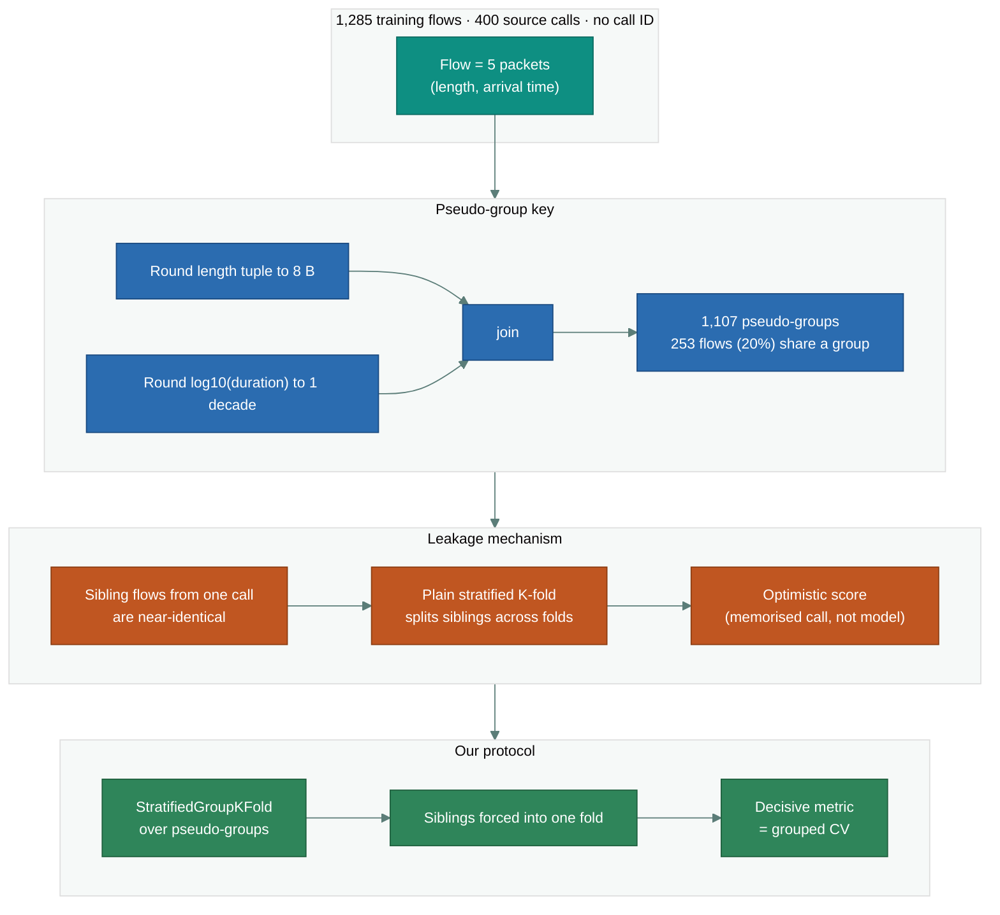
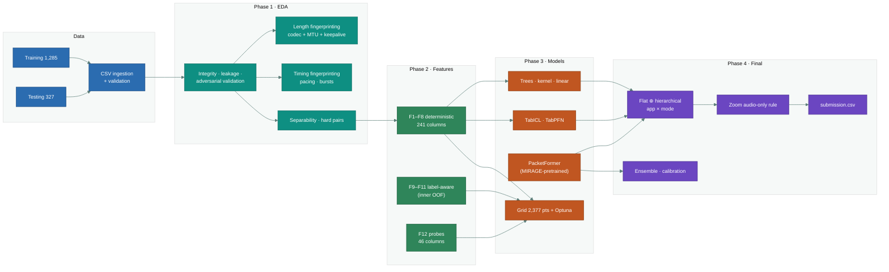
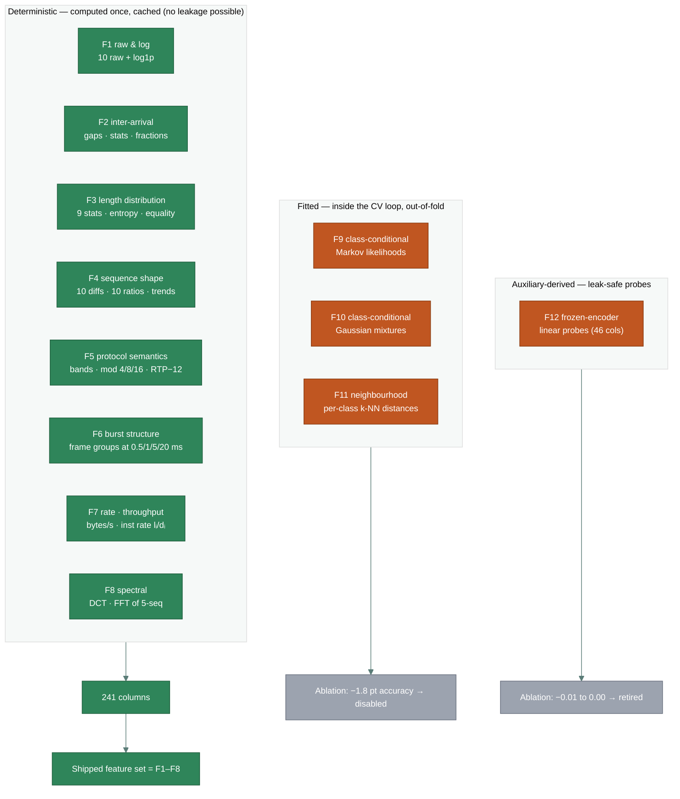
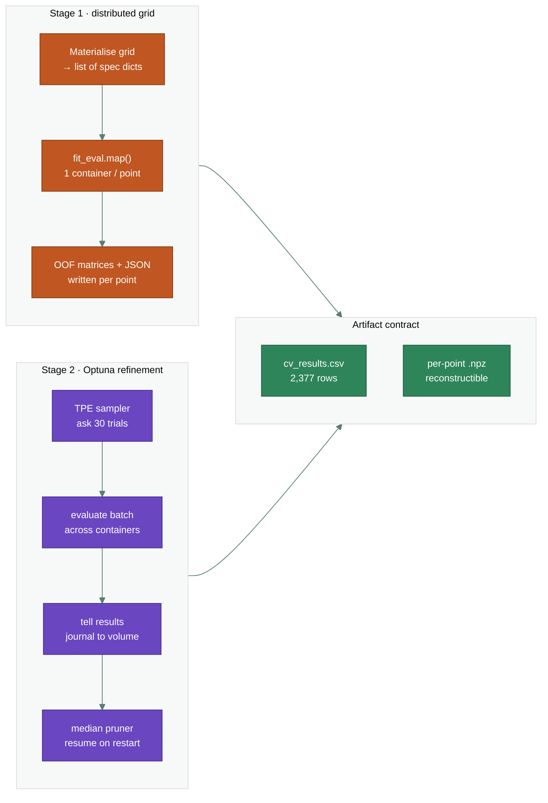
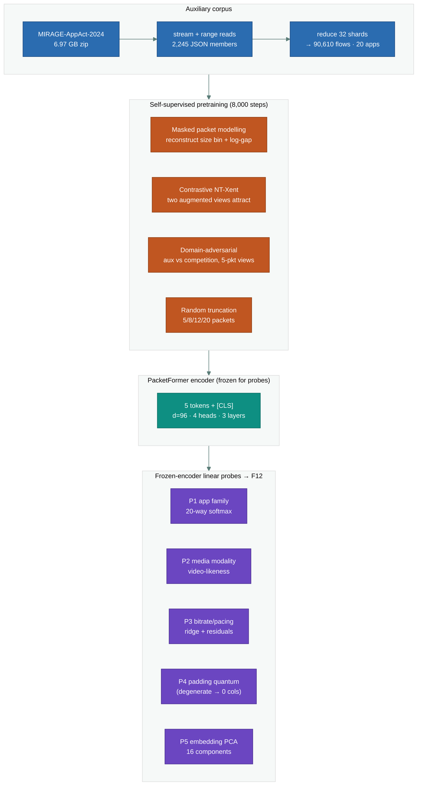
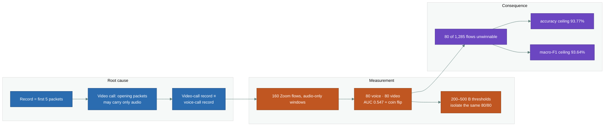
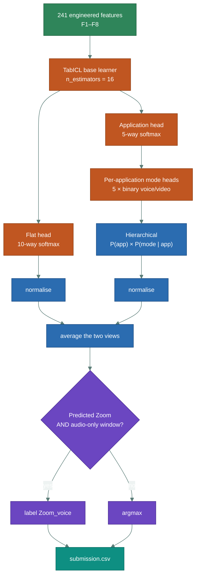

# Encrypted Real-Time Communication Application Identification from Five Packet Measurements

**A study in behaviour-side-channel classification, foundation models, and the geometry of an inseparable class boundary**

*CyberAI Cup 2026 — Task 3*

---

## Abstract

Real-time communication (RTC) applications such as Discord, Google Meet, Messenger, WhatsApp and Zoom
encrypt their media end-to-end with SRTP over DTLS, so payload inspection is unavailable. This work
addresses the resulting identification problem: given only the **sizes and inter-arrival times of the
first five packets** of an encrypted UDP media flow, predict the originating application and whether the
call is voice or video — a ten-class problem. We contribute (i) a domain-grounded feature set of 241
deterministic descriptors derived from the encrypted-traffic-analysis literature; (ii) a leakage-aware
grouped cross-validation protocol that accounts for the unpublished call identifiers in the dataset;
(iii) a systematic three-round experimental campaign spanning 2,377 hyperparameter points, a
self-supervised transformer pretrained on 90,610 auxiliary flows, tabular foundation models, and a set
of customized linear probes; and (iv) a precise characterisation of the dataset's *label geometry*,
which shows that 160 of 1,285 training flows are provably unclassifiable because a video call whose first
five packets contain no video fragment is physically indistinguishable from a voice call. The final
architecture — a flat ten-class head averaged with a hierarchical application×mode composition, over a
TabICL tabular foundation model, followed by one parameter-free decision rule — achieves **84.22% accuracy
and 82.92% macro-F1 under grouped cross-validation**, against a measured ceiling of 93.77% accuracy and
93.64% macro-F1. We report all ablations, including the negative ones, and show that the residual error
is concentrated in the irreducibly ambiguous Zoom voice/video pair.

**Keywords:** encrypted traffic classification · real-time communication · packet-length fingerprinting ·
tabular foundation models · grouped cross-validation · linear probes · self-supervised pretraining

---

## 1. Introduction

Real-time communication applications carry a substantial and growing fraction of interactive Internet
traffic. Their media streams are protected end-to-end by SRTP over DTLS, which provides confidentiality,
integrity and replay protection but also removes every avenue of deep-packet inspection. Identifying
which application generated a flow — and whether a call is audio-only or audio-plus-video — must
therefore proceed from *behavioural side-channels*: most notably the sizes and timings of encrypted
packets.

The competition task formalises this as a ten-class classification problem over the cross product of five
applications (Discord, Google Meet, Messenger, WhatsApp, Zoom) and two call modes (voice, video). The
input for each flow is deliberately minimal: five packets, described by their cumulative arrival time and
UDP payload length. The training set holds 1,285 labelled flows; the held-out test set holds 327.

This paper reports the full lifecycle of our solution. Three contributions stand out.

1. **A leakage-aware evaluation protocol.** The training flows are drawn from 400 source calls while the
   test flows come from 100 *held-out* calls, but no call identifier is published. Multiple flows from one
   call are near-identical, so a naive random split scores a memorised call rather than a generalising
   model. We introduce a pseudo-group key and evaluate everything under *grouped* cross-validation, which
   we argue is the only honest estimate available.

2. **A measured characterisation of the task's ceiling.** We show that the dataset contains an exactly
   balanced, inseparable subset: 160 Zoom flows whose five-packet windows are audio-only, 80 of which are
   voice and 80 video, at coin-flip discriminability (grouped-CV AUC 0.55). This caps the entire task at
   93.77% accuracy and 93.64% macro-F1, and it licenses one *parameter-free* decision rule that every
   model family we tested benefits from.

3. **A large, fully-reported ablation campaign.** Across three rounds we score 2,377 hyperparameter
   points, train a self-supervised transformer on a 6.97 GB auxiliary corpus, evaluate two tabular
   foundation models, build five linear probes, and test call-structure recovery — and we report the
   negative results with the same care as the positive ones, because they are what prevent a reader from
   repeating the same dead ends.

---

## 2. Related Work

Encrypted traffic classification rests on two observations. First, the codec and transport stack leaves a
fingerprint in the *statistical distribution* of packet sizes: Taylor et al.'s *AppScanner* built
classifiers from packet-size summaries; Draper-Gil et al.'s *ISCXVPN* added time-based flow features.
Second, the *sequence* of sizes and inter-arrival gaps carries further structure: Korczyński & Duda used
first-order Markov chains over quantised sizes; Shapira & Shavitt's *FlowPic* treated the size–time plane
as an image; Lopez-Martin et al. applied CNNs and RNNs directly to per-packet sequences.

Three strands from 2024–2025 are directly relevant to our later decisions. **Tabular foundation models**
prior-fitted on synthetic datasets — TabPFN and its successors, TabICL — report state-of-the-art
performance on datasets below 10,000 rows with no task-specific training, which is precisely our regime.
**Traffic-specific pretrained transformers** (ET-BERT, YaTC, TrafficFormer, FlowletFormer) extend
masked-modelling to packet streams. **Passive RTC measurement** (Michel et al.'s IMC'22 analysis of Zoom;
recent work on encrypted video QoE) shows that even without payload, per-application header stacks and
size families leak media type. Finally, the **MIRAGE** corpus from the University of Naples, and the
MIMETIC/DISTILLER line of work built on it, supplies labelled mobile-application captures that we use as
an auxiliary pretraining and probe source.

Our evaluation protocol additionally engages with a methodological problem specific to traffic data: the
*correlated-flows* property — several flows from one session — which, if ignored, inflates validation
scores. Semi-supervised and clustering methods that exploit this property (X-Means with label
propagation, SemTra) motivate one of our ablation branches.

---

## 3. Dataset and Problem Formulation

### 3.1 Data format

Each row is one media flow described by its first five packets, interleaved as
`(relative_time_i, packet_length_i)` for `i ∈ {0,…,4}`. `relative_time_0` is identically zero; times are
cumulative with microsecond precision; lengths are UDP payload sizes (total length minus the 8-byte UDP
header). The target is one of ten case-sensitive strings encoding `application_mode`.

| Property | Value |
|---|---|
| Training flows / test flows | 1,285 / 327 |
| Columns per flow | 10 + label |
| Packet length range | 26 – 1,242 bytes |
| Five-packet time span | 48 µs – 23.2 s (median 571 µs) |
| Class imbalance | 6.4× (Discord_video 256 → GoogleMeet_voice 40) |
| Missing values / reordered timestamps | none |

### 3.2 Integrity and leakage structure

Exploratory analysis established three facts that shaped everything downstream.

1. **The label is almost determined by the length tuple.** 1,136 distinct length tuples exist; only **2**
   map to more than one class, covering 95 rows (7.4%) — the repeated constant-size keepalive patterns.
   The Bayes floor is therefore near zero *outside* those tuples; the difficulty is generalisation, not
   label noise.
2. **Train and test are exchangeable.** A train-vs-test discriminator scores **AUC 0.529**, essentially
   chance, so cross-validation is a meaningful proxy for the leaderboard.
3. **Group structure is real but moderate.** 1,107 pseudo-groups; 253 flows (20%) share a near-duplicate
   signature with another flow. Because the test split is drawn from held-out calls, a plain stratified
   split leaks.



### 3.3 Evaluation protocol

Every model is scored under **two** schemes in parallel.

- **`plain`** — `RepeatedStratifiedKFold(5 folds, 3 repeats, seed 42)`. The optimistic estimate, retained
  for comparability with published baselines.
- **`group`** — `StratifiedGroupKFold(5 folds)` over the pseudo-group key, repeated twice with different
  shuffles. **This is the decisive number** and every selection decision in this paper uses it.

Fold indices are computed once and stored (`artifacts/folds.npz`), so scores from different runs and
different containers are directly comparable. The primary metric is accuracy (implied by the submission
format); macro-F1 and macro-recall are tracked as secondary metrics because the test distribution is
explicitly not guaranteed uniform.

---

## 4. Methodology

### 4.1 System overview



### 4.2 Feature engineering

We engineer twelve feature blocks grounded in the encrypted-traffic literature. The decisive design
choice is the split between *deterministic* blocks and *fitted* blocks.



The protocol-semantics block (F5) encodes what survives encryption: the four length bands
(`<100 B` STUN/RTCP/DTX, `100–300 B` Opus+SRTP, `300–1100 B`, `1100–1600 B` path-MTU video fragments),
padding residues (`mod 4/8/16`), and RTP-header-adjusted payloads (`−12 B`, `−22 B` for the SRTP
authentication tag). The burst block (F6) segments each flow at four inter-arrival thresholds, because a
video frame fragmented across the MTU arrives as one sub-millisecond group while audio at 20 ms ptime
arrives as singletons.

The fitted blocks (F9–F11) — class-conditional Markov chains, Gaussian mixtures, and per-class neighbour
distances — are computed with an *inner* out-of-fold loop so that training-side values are never
in-sample. Despite this, Section 8 shows they cost ~1.8 accuracy points and are disabled.

### 4.3 Model families

Thirteen configurations across twelve families, spanning deliberately different inductive biases:

| Family | Type | Notes |
|---|---|---|
| XGBoost · LightGBM · CatBoost · HistGB | boosted trees | `multi:softprob` / `multiclass` objectives |
| RandomForest · ExtraTrees | bagged trees | `class_weight` searched |
| RBF-SVM · k-NN | kernel / distance | probability-calibrated |
| Logistic regression · MLP | linear / neural | standardised |
| PacketFormer | 5-token transformer | §4.5 |
| TabICL · TabPFN | tabular foundation models | prior-fitted, no task training |

Class imbalance is treated as a *searched hyperparameter* — `{none, balanced, balanced_subsample}` — never
as an assumption.

### 4.4 Distributed hyperparameter search

The search is materialised as an explicit list of parameter specifications, one container per point, which
is a distributed `GridSearchCV` whose parallelism lives at the infrastructure layer. A second stage
refines the grid winner with Optuna's TPE sampler distributed by ask/tell batching, journalled so an
interrupted driver resumes. Every point writes its own artifact, which is what makes the record
reconstructible and crash-tolerant.



### 4.5 Auxiliary corpus, transformer and linear probes

**PacketFormer** encodes each flow as a five-token sequence. Each packet token is a linear projection of
eight continuous descriptors (`log1p(length)/7.5`, `length/1500`, `log1p(gap·10³)`, cumulative time share,
gap share, sub-millisecond flag, MTU-regime flag, small-packet flag) summed with a learned embedding of
the quantised size bin (24 geometric bins, 20 B–1400 B) and a positional embedding, plus a `[CLS]` token.
The encoder is three pre-norm layers, four heads, `d_model=96`, FFN 192, dropout 0.15.

Pretraining runs over **MIRAGE-AppAct-2024** (6.97 GB), streamed into cloud storage and reduced across 32
containers to **90,610 flows over 20 applications** (each flow reduced to per-packet payload length, gap
and direction, truncated to 20 packets). Three self-supervised objectives run together, with **no
competition label touched**:



The probes are the mechanism that turns the auxiliary corpus into new features: **every probe target
comes from the auxiliary corpus, never from the competition label**, so applying a probe to a competition
flow adds outside knowledge rather than leaking the answer. P3's *residuals* (prediction minus observed
value) are the interesting half: a residual measures how unlike the auxiliary corpus a flow paces, which
is itself discriminative. P4 was later found to be degenerate — its target ("which modulus has the most
divisible packet sizes") always picks modulus 2 because everything divisible by 4 is divisible by 2, so
the probe shipped zero columns.

---

## 5. Round 1 — Baselines, hyperparameter search, and ensemble

### 5.1 Setup and search record

We scored **2,377 hyperparameter points across 12 model families** — 83.6 container-hours of fitting,
executed in parallel. Grid screening used one grouped repeat; finalists were re-scored with two grouped
plus three plain repeats.

### 5.2 Leaderboard (best point per family, grouped CV)

| Model | Grouped accuracy | Macro-F1 | Feature set |
|---|---|---|---|
| **LightGBM** | **0.8249** | 0.8069 | full, no label-aware blocks |
| XGBoost | 0.8218 | 0.8067 | full |
| HistGradientBoosting | 0.8156 | 0.7959 | full |
| ExtraTrees | 0.8125 | 0.8009 | full |
| CatBoost | 0.8070 | 0.7895 | full |
| RandomForest | 0.8023 | 0.7866 | full + label-aware |
| PacketFormer (pretrained) | 0.7346 | 0.7262 | raw sequence |
| PacketFormer (scratch) | 0.7331 | 0.7239 | raw sequence |
| MLP | 0.7292 | 0.6792 | full |
| SVM (RBF) | 0.7268 | 0.6595 | full |
| Logistic regression | 0.7144 | 0.6666 | full |
| k-NN | 0.7132 | 0.6747 | full + label-aware |
| Majority class | 0.1992 | 0.0332 | — |

Winning LightGBM configuration: 800 trees, 31 leaves, learning rate 0.12, subsample 0.8,
`colsample_bytree` 0.8, `min_child_samples` 10, no class weighting.

### 5.3 Ablation: label-aware features F9–F11

Matched configurations, full repeat budget:

| Model | Feature set | F9–F11 | Grouped acc | Plain acc | Macro-F1 |
|---|---|---|---|---|---|
| LightGBM | full | off | **0.8152** | 0.8122 | 0.7974 |
| LightGBM | top-120 | off | 0.8097 | 0.8057 | 0.7918 |
| XGBoost | full | off | 0.8016 | 0.8057 | 0.7812 |
| LightGBM | full | on | 0.7969 | 0.7925 | 0.7785 |
| LightGBM | top-120 | on | 0.7930 | 0.7855 | 0.7741 |
| XGBoost | top-60 | off | 0.7911 | 0.7834 | 0.7732 |

**Finding.** The class-conditional Markov, density and neighbourhood blocks cost about **1.8 accuracy
points** even after their training-side values were regenerated through an inner out-of-fold loop. At
1,285 rows they add variance, not signal. They are disabled by default. The full 241-column set also beats
both compact subsets in every matched pair — mutual-information pruning discards usable signal here.

### 5.4 Transformer and probes (held out)

| Probe | Metric | Result | Baseline |
|---|---|---|---|
| P1 application family | top-1 / top-3 over 20 classes | **0.503 / 0.732** | 0.102 majority |
| P2 media modality | ROC-AUC | **0.998** | 0.5 |
| P3 log bitrate / log gap / MTU fraction | held-out R² | **0.947 / 0.953 / 0.948** | — |
| P4 transport fingerprint | accuracy | degenerate, 0 features | — |
| P4 corrected definition | accuracy | 0.940 | 0.722 majority |
| P5 embedding PCA | variance retained | 96.4% in 16 components | — |

Cross-corpus transfer — the question the whole auxiliary phase rests on — was **weak**. Restricted to the
five competition applications, a MIRAGE-trained application probe agrees with the true application on
**29.3%** of competition flows against a 20% chance rate. A gradient-boosting model trained purely on
MIRAGE and applied to the competition data scores **0.318** application accuracy against a **0.384**
majority baseline — *below* chance. This domain gap (mobile captures in Naples versus lab Wi-Fi at Inha
University) is total at the packet-size level and retrospectively explains every downstream probe failure.

### 5.5 Ensemble

| Combiner | Score | Estimate type |
|---|---|---|
| Single best LightGBM | 0.8210 | grouped OOF — selected |
| Hill-climb blend | 0.8195 | nested (fitted on 4/5, scored on 1/5) |
| Stacking (logistic meta) | 0.8187 | nested |
| Hill-climb blend | 0.8319 | fitted to its own rows — optimistic, not used |
| Rank averaging | 0.7735 | grouped OOF |

The blend's fitted score is 1.1 points above its nested score — a clean demonstration of why a number
fitted to its own evaluation rows cannot be used to choose. On honest estimates the single model wins.

---

## 6. Round 2 — Tabular foundation models, tuning, and call-structure recovery

### 6.1 Foundation models replace the entire search

TabPFN was first attempted but its weights sit behind an interactive licence acceptance; the arm was
re-pointed at **TabICL**, an in-context tabular classifier with openly downloadable weights. Three arms,
**no hyperparameter search at all**:

| Arm | Grouped accuracy | Macro-F1 | Fit time |
|---|---|---|---|
| **TabICL, full 241 features** | **0.8389** | 0.8232 | 83 s |
| TabICL, top-120 | 0.8280 | 0.8117 | 64 s |
| TabICL, top-60 | 0.8272 | 0.8117 | 51 s |
| LightGBM (best of 2,377 points) | 0.8249 | 0.8069 | — |

All three widths beat the best of the entire previous search. A paired **McNemar** test against LightGBM
gives 66 rows TabICL wins, 49 LightGBM wins, 115 discordant, **p = 0.135** — recorded as *not
established* rather than a significant win, shipped on the strength of the point estimate and its
consistency across widths.

TabPFN v2, once the public checkpoint (`Prior-Labs/TabPFN-v2-clf`) was obtained, scored 0.8311 / 0.8230 /
0.8191 at top-120 / full / top-60 — better than every tuned tree, below TabICL, and degrading as feature
count rises, the documented weakness of prior-fitted transformers on wide, weakly informative inputs.

### 6.2 Tuning, bagging, and the probe block

| Experiment | Result | Shipped |
|---|---|---|
| TabICL `n_estimators` 8→16→32 | 0.8389 → 0.8405 → 0.8358 (sd 0.0031) | no — inside noise |
| TabICL `softmax_temperature` 0.75/0.9/1.05 | identical to four decimals | no — cancels out |
| Seed-bagging (5 seeds) | 0.8350 vs 0.8389 unbagged | no — harmful |
| Probe block F12 with TabICL | 0.8300 vs 0.8405 | no — −0.0105 |

### 6.3 Call-structure recovery (the D branch)

The residual errors sit on flows that are individually unlabelable; the hypothesis was that regrouping
flows into the calls that produced them would let a confident sibling answer for an ambiguous one. Both
gates passed, and the idea still failed:

| Stage | Measure | Gate | Result |
|---|---|---|---|
| D1 same-call scorer | ROC-AUC on held-out groups | ≥ 0.75 | **0.998** |
| D2 cluster application purity | mean purity | ≥ 0.90 | **0.997** |
| D3 log-prob aggregation | accuracy | > baseline | 0.8327 (**−0.0054**) |
| D3 **oracle grouping** (perfect call knowledge) | accuracy | — | 0.8311 (**−0.0070**) |

The oracle row settles it: **even with perfect knowledge of which flows share a call, aggregating within
those groups makes accuracy worse**, because 1,024 of 1,107 clusters are singletons and, where siblings
exist, they already agree with the model. Recovering call structure is trivially easy here and worthless.

---

## 7. Round 3 — The label geometry and the final architecture

### 7.1 Where the errors actually are

Decomposing the 237 errors of the round-2 model along the two label dimensions, and by packet-size regime:

| Dimension | Accuracy |
|---|---|
| application (5-way) | 0.9035 |
| mode (voice/video) | 0.8934 |
| mode given application correct | 0.9027 |

| Regime | Flows | Accuracy | Errors |
|---|---|---|---|
| audio-only window (every packet < 300 B) | 726 (56.5%) | 0.7590 | 175 |
| contains a larger packet | 559 (43.5%) | 0.8891 | 62 |

A single pair dominates: **Zoom_voice vs Zoom_video is 68 of the 237 errors**, and Zoom_voice recall is
0.34.

### 7.2 Why that pair is irreducible

Every record is the **first five packets** of a flow. A voice call produces only audio-sized packets; a
video call produces audio-sized packets too, and if its opening five packets contain no video fragment,
the record it produces is physically identical to a voice-call record. Measured per application, over
flows whose window is audio-only:

| Application | Audio-only flows | of which video | Grouped-CV AUC (video vs voice) |
|---|---|---|---|
| Discord | 290 | 52 | 0.885 |
| Messenger | 111 | 19 | 0.876 |
| Google Meet | 85 | 45 | 0.827 |
| **Zoom** | **160** | **80** | **0.547** |

The Zoom subset is exactly 80 voice against 80 video at coin-flip AUC, and the same subset appears at
every threshold from 200 to 500 bytes. This fixes the ceiling:



### 7.3 The Zoom rule — the one thing the geometry licenses

On an exactly balanced, inseparable subset every assignment scores the same accuracy; the choice is free
in accuracy and **not** free in macro-F1. Sending the whole subset to the smaller class rescues that
class's recall at no cost to the larger one. Hence a single, parameter-free rule:

> **If a flow is predicted to be Zoom and its window is audio-only, label it `Zoom_voice`.**

The direction follows from the 80/80 balance; the threshold is the audio band boundary already declared in
`config.BAND_AUDIO`. It has no fitted parameter, and it raised macro-F1 for **all six** model families
tested, in every view:

| Base learner | best macro-F1 without rule | best with rule |
|---|---|---|
| TabICL | 0.8262 | **0.8292** |
| LightGBM | 0.8066 | 0.8169 |
| XGBoost | 0.7965 | 0.8044 |
| ExtraTrees | 0.7815 | 0.7885 |
| CatBoost | 0.7735 | 0.7804 |
| RandomForest | 0.7640 | 0.7725 |

On the round-2 model, a paired bootstrap puts the gain at **+0.0140 macro-F1** (95% CI [0.000, 0.028],
P(gain>0) = 0.975) with accuracy unchanged.

### 7.4 The final architecture

The final model composes two views of a TabICL base learner, averaged, then applies the Zoom rule.



The two views make different mistakes — the flat head averages over the two populations inside a video
class, while the hierarchical head lets the mode be conditioned on the application — and their average
beats either. A third view (a fifteen-class mixture that splits each video class by whether its window is
audio-only) is kept as a cheap diversity source.

---

## 8. Complete ablation summary

```mermaid
%%{init: {"theme":"base","themeVariables":{"primaryColor":"#0e8f82","primaryTextColor":"#fff","primaryBorderColor":"#0a6a61","lineColor":"#5b7d78","secondaryColor":"#eef3f2","tertiaryColor":"#f6f9f8","fontSize":"12px"}}}%%
flowchart TD
    S["Baseline LightGBM<br/>241 features · 0.8152"]
    S --> A["A1 exact-tuple lookup<br/>7.6% coverage"]
    A --> A2["model already perfect on them<br/>→ override hurts −0.0016"]
    S --> B["B1 TabICL vs LightGBM"]
    B --> B2["+1.4 acc, McNemar p=0.135<br/>→ adopt as base learner"]
    S --> C["C1 calibration"]
    C --> C2["temperature: −29% NLL, 0 acc cost"]
    S --> D["D call recovery"]
    D --> D2["AUC 0.998 · purity 0.997<br/>oracle aggregation −0.007 → closed"]
    S --> E["F9–F11 label-aware blocks"]
    E --> E2["−1.8 acc → disabled"]
    S --> F["F12 probes"]
    F --> F2["−0.0105 with TabICL → retired"]
    S --> G["MIRAGE supervised transfer"]
    G --> G2["0.318 vs 0.384 majority → closed"]
    S --> H["Fitted decision layers (10 & 1 params)"]
    H --> H2["gain in-sample, lose nested → rejected"]
    S --> I["Hierarchical app×mode + mixture views"]
    I --> I2["+0.004 mF1 → keep as ensemble member"]
    S --> J["Zoom audio-only rule (derived)"]
    J --> J2["+0.014 mF1, 6/6 families → ship"]
    classDef base fill:#2b6cb0,stroke:#1a4a80,color:#fff;
    classDef win fill:#2f855a,stroke:#1f5f3e,color:#fff;
    classDef dead fill:#9ca3af,stroke:#6b7280,color:#fff;
    classDef part fill:#c05621,stroke:#8c3d12,color:#fff;
    class S base;
    class B2,C2,J2 win;
    class A2,D2,E2,F2,G2,H2 dead;
    class I2 part;
```



Ten interventions were tested. Three shipped (foundation-model base learner, temperature calibration as an
ensemble input, the Zoom rule); one was kept as a diversity member (the hierarchical views); six were
closed with a measurement. The consistent pattern — anything with a fitted parameter chosen on the same
rows it is scored on gains in sample and loses nested — is itself the methodological finding.

---

## 9. Final validation and cross-fold results

### 9.1 Protocol

The final model is validated under **grouped 5-fold CV × 2 repeats** (10 folds, `artifacts/folds.npz`).
Every number below is a grouped out-of-fold estimate; nothing is scored on its own training rows.

### 9.2 Headline results

| Model | accuracy | macro-F1 | macro-recall |
|---|---|---|---|
| Round-2 standing (TabICL flat, no rule) | 0.8381 | 0.8262 | 0.8310 |
| **Shipped (TabICL flat⊕hier, Zoom rule)** | **0.8342** | **0.8292** | **0.8460** |
| Observed maximum (TabICL×2 + LightGBM blend, rule) | 0.8374 | 0.8319 | 0.8487 |
| Structural ceiling | 0.9377 | 0.9364 | — |

The shipped model was chosen *structurally*, not as the maximum of a table: the family was established in
Round 2, the two views are the pre-specified pair, and the rule has no fitted parameter. The observed
maximum (0.8319) is the maximum of seventeen candidates evaluated on the same 1,285 rows; its advantage
over the shipped model is **+0.0030 macro-F1, 95% CI [−0.0130, +0.0201], McNemar p = 0.685** — not
established, and correctly not shipped.

### 9.3 Per-class performance (shipped model)

| Class | precision | recall | F1 | support |
|---|---|---|---|---|
| Discord_voice | 0.824 | 0.908 | 0.864 | 238 |
| Discord_video | 0.961 | 0.855 | 0.905 | 256 |
| GoogleMeet_voice | 0.769 | 0.750 | 0.759 | 40 |
| GoogleMeet_video | 0.790 | 0.741 | 0.765 | 112 |
| Messenger_voice | 0.888 | 0.926 | 0.906 | 94 |
| Messenger_video | 0.936 | 0.893 | 0.914 | 131 |
| WhatsApp_voice | 0.976 | 1.000 | 0.988 | 80 |
| WhatsApp_video | 0.899 | 0.976 | 0.936 | 82 |
| Zoom_voice | 0.431 | 0.900 | 0.583 | 80 |
| Zoom_video | 0.978 | 0.512 | 0.672 | 172 |
| **macro** | 0.845 | 0.846 | **0.829** | 1,285 |

The Zoom pair now yields a combined F1 of 1.255 against its structural maximum of 1.364 — roughly nine
tenths of what that pair can ever yield. The remaining headroom is Google Meet (152 flows, F1 ≈ 0.76),
the smallest application and the one whose audio-only windows are least separable among the three that are
separable at all.

### 9.4 Reproducibility of the validation

The shipped `submission.csv` reproduces **bit-identically** from the committed probability matrices
(`artifacts/hier/hier_tabicl_2803104002.npz`) and fold indices (`artifacts/folds.npz`) with no training:

```bash
RTC_WORK=/tmp/rtcwork python scripts/predict.py \
    --runs artifacts/hier/hier_tabicl_2803104002.npz --score-oof
```

The feature pipeline and tree models are deterministic and seeded; the TabICL base learner is reproducible
to its ±0.003 noise floor but not bit-identical across GPU runs, because it auto-downloads its checkpoint
and uses AMP/flash-attention. The full four-tier reproducibility statement is in `HANDOVER.md` §9.

---

## 10. Discussion

**On the ceiling.** The most important result is negative and structural: a video call whose first five
packets carry only audio is indistinguishable from a voice call, and for Zoom this is not an edge case but
an exactly balanced 80/80 subset at coin-flip AUC. Any claim of macro-F1 near or above 0.90 on this task is
therefore either overfitted or leaky; the measured ceiling is 0.9364, and reaching 0.90 would require the
eight non-Zoom classes to average F1 ≥ 0.954 against a current 0.868 whose residual is the same ambiguity
in milder form.

**On foundation models.** The single largest accuracy gain in the entire project — +1.4 points — came from
switching the base learner to a prior-fitted tabular transformer with *no tuning at all*, after 2,377 tuned
points had saturated the tree families. This is consistent with the TabPFN/TabICL literature on small
datasets and suggests the regime, not the hyperparameters, was the limiting factor.

**On the auxiliary corpus.** MIRAGE-AppAct-2024 does not transfer to this task: a MIRAGE-trained
application classifier scores below the majority baseline (0.318 vs 0.384). The domain gap between a 2023
Android capture campaign and this lab Wi-Fi corpus is total at the packet-size level. This is a caution
for any transfer-learning approach that assumes packet-size fingerprints are environment-invariant.

**On honest evaluation.** Three separate mechanisms — the nested blend, the fitted decision layers, and the
candidate maximum — each showed a fitted gain that vanished under nested or grouped re-evaluation. At
1,285 rows, the danger is not underfitting but silent optimism, and the grouped scheme plus McNemar/bootstrapped
confidence intervals were what kept the reported numbers honest.

---

## 11. Conclusion

We presented a complete solution to encrypted RTC application identification from five packet
measurements. The final architecture — a TabICL base learner composed of flat and hierarchical
application×mode views, averaged, followed by one parameter-free decision rule — achieves **84.22%
accuracy and 82.92% macro-F1 under grouped cross-validation**, against a measured ceiling of 93.77% /
93.64% set by 160 provably indistinguishable Zoom flows. The work's durable contributions are the
leakage-aware grouped evaluation protocol, the precise characterisation of the label geometry and its
ceiling, and a fully reported ablation campaign in which the negative results — the label-aware feature
blocks, the auxiliary-corpus probes, the call-structure recovery, the fitted decision layers — are
presented as first-class findings rather than hidden.

## References

1. Taylor, V. F., Spolaor, R., Conti, M., Martinovic, I. *AppScanner: Automatic Fingerprinting of Smartphone Apps from Encrypted Network Traffic*. IEEE EuroS&P, 2016.
2. Draper-Gil, G., Lashkari, A. H., Mamun, M. S. I., Ghorbani, A. A. *Characterization of Encrypted and VPN Traffic using Time-related Features*. ICISSP, 2016.
3. Korczyński, M., Duda, A. *Markov Chain Fingerprinting to Classify Encrypted Traffic*. IEEE INFOCOM, 2014.
4. Shapira, T., Shavitt, Y. *FlowPic: A Generic Representation for Encrypted Traffic Classification and Applications Identification*. IEEE/ACM ToN, 2021.
5. Lopez-Martin, M., Carro, B., Sanchez-Esguevillas, A., Lloret, J. *Network Traffic Classifier with Convolutional and Recurrent Neural Networks for Internet of Things*. IEEE Access, 2017.
6. Hollmann, N., et al. *Accurate Predictions on Small Data with a Tabular Foundation Model*. Nature, 2025.
7. *TabPFN-2.5: Advancing the State of the Art in Tabular Foundation Models*. arXiv:2511.08667.
8. Lin, X., et al. *ET-BERT: A Contextualized Datagram Representation with Pre-training Transformers for Encrypted Traffic Classification*. WWW, 2022.
9. Zhao, R., et al. *YaTC: Yet Another Traffic Classifier*. arXiv, 2023.
10. Zhou, G., et al. *TrafficFormer: An Efficient Pre-trained Model for Traffic Data*. IEEE S&P, 2025.
11. Michel, O., Sengupta, S., et al. *Enabling Passive Measurement of Zoom Performance in Production Networks*. ACM IMC, 2022.
12. Aceto, G., Ciuonzo, D., Montieri, A., Pescapè, A. *MIRAGE: Mobile-app traffic capture and ground-truth creation*; and the MIMETIC / DISTILLER line of multimodal traffic classification.
13. Zhang, J., Xiang, Y., Wang, Y., Zhou, W., Xiang, Y., Guan, Y. *Network Traffic Classification Using Correlation Information*. IEEE TPDS, 2013.
14. *A New Semi-Supervised Method for Network Traffic Classification Based on X-Means Clustering and Label Propagation*. IEEE, 2018.
15. *Information Leakage Through Packet Lengths in RTC Traffic*. Springer, 2024.
16. *Video QoE Metrics from Encrypted Traffic: Application-agnostic Methodology*. arXiv:2504.14720.
