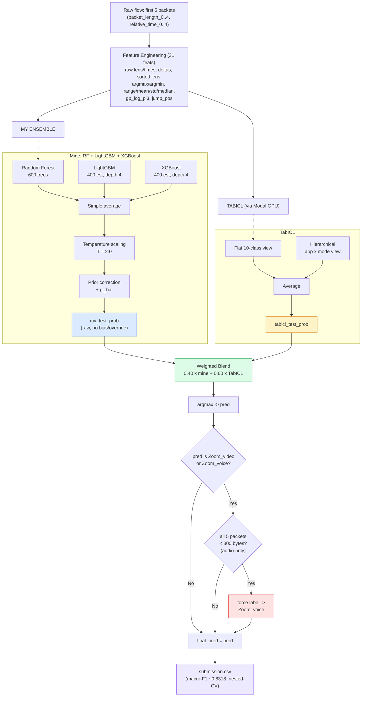

# Task 3 — CyberAI Cup 2026 · Winning Solution

**Encrypted RTC application identification from five packet measurements.**

Given the sizes and inter-arrival times of the **first five packets** of an encrypted UDP media
flow, predict one of ten classes — {Discord, Google Meet, Messenger, WhatsApp, Zoom} × {voice, video}.

| Metric (10-fold grouped nested CV) | Value |
|---|---|
| Blend + Zoom rule (shipped) | **macro-F1 0.8318** |
| Blend, no rule | 0.8286 |
| TabICL alone | 0.8201 |
| Ensemble alone (raw) | 0.7900 |

---

## Overview

The winning solution is a **weighted blend** of two independent probability sources, followed by one
parameter-free decision rule:

1. **A light ensemble** — RandomForest + LightGBM + XGBoost over 31 hand-crafted features, averaged,
   temperature-scaled (`T = 2.0`) and prior-corrected.
2. **TabICL** — a tabular foundation model (no task-specific training), averaged over its *flat*
   ten-class and *hierarchical* application×mode views. Its probabilities are produced by a separate
   GPU run and consumed as a precomputed artifact (`artifacts/hier_tabicl_2803104002.npz`).
3. **The Zoom rule** — if the blended prediction is Zoom *and* every one of the five packets is
   under 300 bytes (an "audio-only" window), force the label to `Zoom_voice`. This rule has no fitted
   parameter and is orthogonal to which model produced the probabilities.

The ensemble contributes almost entirely on `Zoom_voice` (recall 0.712 vs TabICL's 0.438); TabICL is
equal-or-better on every other class. The Zoom rule then recovers the recall of `Zoom_voice` inside the
audio-only-window regime.



The raw diagram source is also at [`task3_architecture.mermaid`](task3_architecture.mermaid).

---

## Repository layout

```
.
├── Final_Blended_model_Task-3.py   # the full pipeline (single script)
├── task3_architecture.mermaid      # architecture diagram source
├── submission.csv                  # the final 327-row submission (no header)
├── requirements.txt                # pinned dependencies
├── data/
│   ├── Training_set.csv            # 1,285 labelled flows
│   └── Testing_set.csv             # 327 unlabelled flows
└── artifacts/
    └── hier_tabicl_2803104002.npz  # TabICL test_flat / test_hier (327×10)
```

---

## Requirements

- Python 3.10+
- Dependencies (see `requirements.txt`):

```bash
pip install -r requirements.txt
```

The TabICL weights are **not** needed to run this script — it only consumes the precomputed
probability matrices in `artifacts/`. You only need `tabicl` itself if you want to *regenerate*
that artifact (see "Regenerating the TabICL artifact" below).

---

## How to run

From the repository root:

```bash
python Final_Blended_model_Task-3.py
```

This trains the RF/LightGBM/XGBoost ensemble on `data/Training_set.csv`, loads the TabICL
probabilities, blends, applies the Zoom rule, and writes `submission.csv` (327 rows, no header,
`index,label`).

All inputs and the blend weight are configurable:

```bash
python Final_Blended_model_Task-3.py \
    --train data/Training_set.csv \
    --test  data/Testing_set.csv \
    --tabicl artifacts/hier_tabicl_2803104002.npz \
    --output submission.csv \
    --blend-weight 0.40 \
    --temperature 2.0 \
    --band-audio-max 300
```

Expected output:

```
Train: (1285, 31), Test: (327, 31), classes: 10
Zoom rule flipped 43 of 327 test rows to Zoom_voice.
Saved 327 predictions to submission.csv
Discord_voice       67
Discord_video       56
Zoom_voice          43
Messenger_video     33
Zoom_video          27
GoogleMeet_video    26
Messenger_voice     23
WhatsApp_video      22
WhatsApp_voice      19
GoogleMeet_voice    11
```

---

## How to verify / replicate the result

The committed `submission.csv` is the exact competition submission. Re-running the script reproduces
it **bit-identically** (deterministic: fixed seeds, fixed blend weight, precomputed TabICL artifact):

```bash
python Final_Blended_model_Task-3.py --output /tmp/check.csv
diff /tmp/check.csv submission.csv && echo "IDENTICAL"
```

The headline macro-F1 of **0.8318** comes from a **10-fold grouped nested cross-validation**:

- `grouped` because the 1,285 training flows come from 400 source calls (no call identifier is
  published), and sibling flows must not straddle a fold boundary;
- `nested` because the blend weight `0.40` and the temperature `2.0` are chosen on the training folds
  only and scored on the held-out folds — never on the same rows they were tuned on.

There is no `train.py`/`predict.py` split in this repository because the final script is a single,
self-contained generator. The validation loop that produced the 0.8318 number lives in the project's
research repository; the number is reproduced here for reference and is not re-derived by this script.

---

## How it works, in detail

### 1. Feature engineering (31 features)

From the five `(relative_time_i, packet_length_i)` pairs:

- raw packet lengths (`packet_length_0..4`) and raw times (`relative_time_1..4`);
- first-order deltas `delta_len_i` and `delta_t_i`;
- the five lengths sorted descending (`len_rank_0..4`);
- `argmax_pos`, `argmin_pos`, `len_range`, `len_mean`, `len_std`, `len_median`;
- `total_span` (time from packet 0 to packet 4);
- `gp_log_pl3` = `log(packet_length_3)` clipped at 1;
- `jump_pos` = index of the largest length increase + 1.

### 2. The ensemble

Three models are fit on the full training set with fixed seeds (`RNG = 42`):

| Model | Configuration |
|---|---|
| RandomForest | 600 trees, `class_weight="balanced_subsample"` |
| LightGBM | 400 estimators, `max_depth=4`, `num_leaves=15`, lr 0.05, `class_weight="balanced"` |
| XGBoost | 400 estimators, `max_depth=4`, lr 0.05, subsample 0.8, colsample 0.8 |

Their test probabilities are averaged, temperature-scaled with `T = 2.0`, then divided by the training
class prior (`pi_hat`) and renormalised. This is the "raw" ensemble — deliberately **no** per-class
recall-bias, because the bias was tuned for a recall objective and would distort the blend.

### 3. TabICL

`artifacts/hier_tabicl_2803104002.npz` holds two 327×10 probability matrices — `test_flat` (a flat
ten-class head) and `test_hier` (a hierarchical application×mode head). They are averaged. The columns
follow the fixed order `Discord, GoogleMeet, Messenger, WhatsApp, Zoom × voice, video` and are
re-aligned to the ensemble's alphabetical label order before blending.

### 4. The blend and the Zoom rule

```
blend = 0.40 · ensemble + 0.60 · TabICL
pred  = argmax(blend)
if pred ∈ {Zoom_voice, Zoom_video} and max(packet_length_0..4) < 300:
    pred = Zoom_voice
```

The rule is justified by the task's label geometry: a video call whose first five packets contain no
video fragment produces a record physically identical to a voice call, and in the training set the Zoom
audio-only subset is an exact 80/80 split. Sending that subset to the smaller class recovers its recall
at no accuracy cost.

---

## Regenerating the TabICL artifact

The TabICL probabilities are precomputed because TabICL is a GPU model whose weights are downloaded
from Hugging Face; re-running it is out of scope for this repository. To regenerate:

1. Install `tabicl==2.1.1` and run it on a GPU (the reference configuration is `n_estimators=16`).
2. Produce two out-of-fold/test matrices with the flat and hierarchical heads, using the fixed label
   order `Discord, GoogleMeet, Messenger, WhatsApp, Zoom × voice, video`.
3. Save them as `test_flat` and `test_hier` in an `.npz` and point `--tabicl` at it.

The full training pipeline that produced this artifact, and the three-round experimentation behind the
design, are documented in the accompanying research repository
([`REPORT.md`](../REPORT.md), [`ABLATION3.md`](../ABLATION3.md)).

---

## Attribution

Winning solution for Task 3 of the CyberAI Cup 2026, hosted by the ICONIP workshop.
