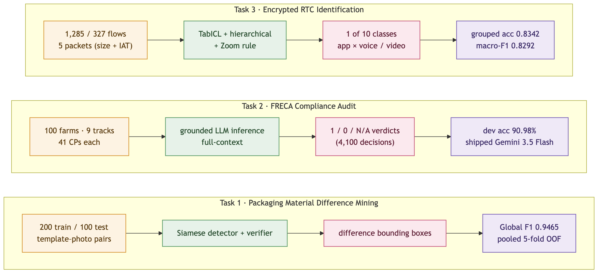
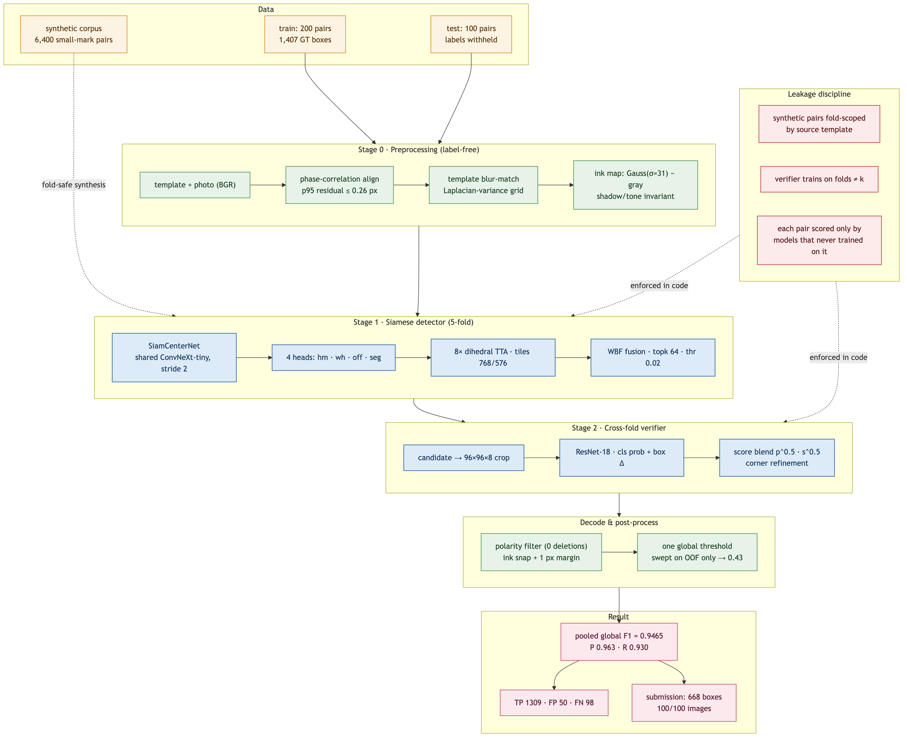
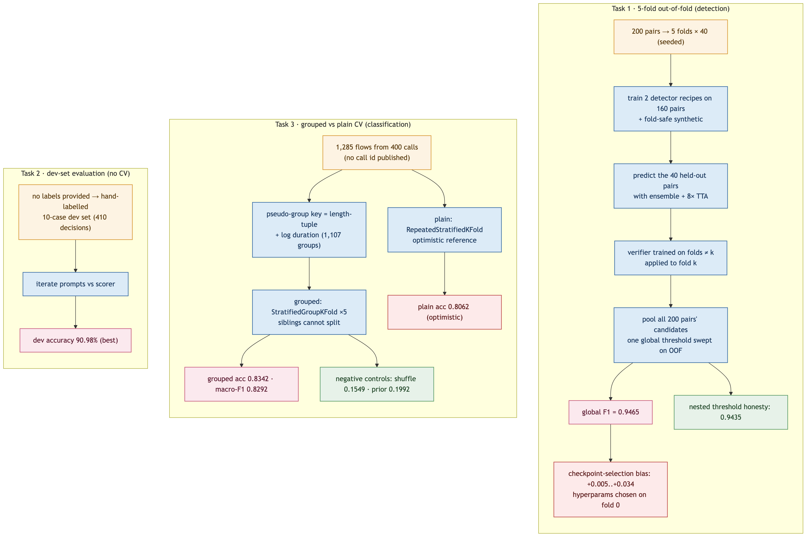
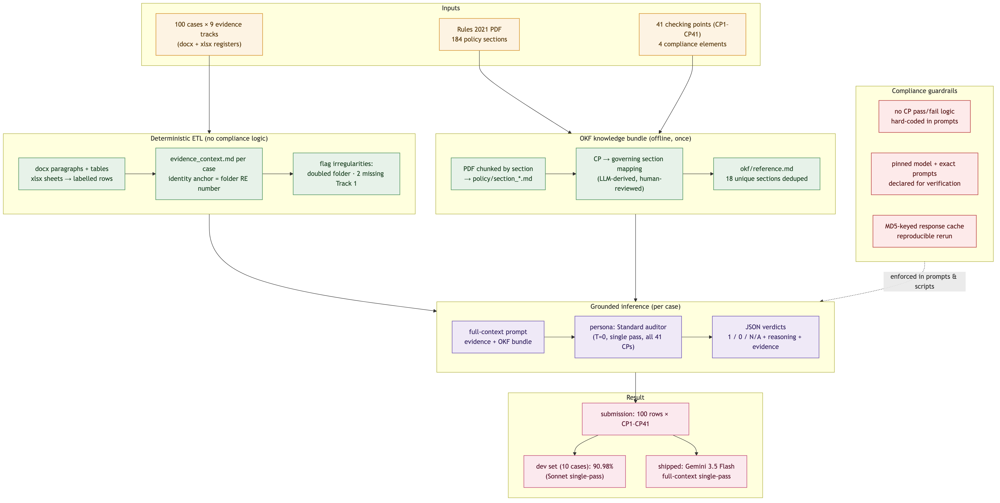
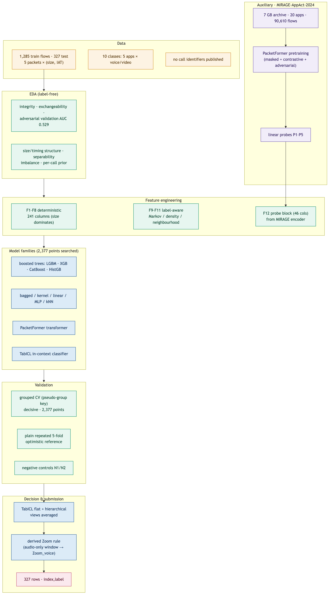

# CyberAI Cup 2026 — Systems Description & Results Report

**Three tasks, one methodological through-line: honest out-of-fold evaluation, measured ceilings, and negative results reported at the same weight as wins.**

Prepared from the complete source repositories of Task 1, Task 2 and Task 3, including the Modal execution substrate (apps, volumes, and fan-out orchestration) used for every training and search stage.

---

## 0. Executive summary

| | Task 1 | Task 2 | Task 3 |
|---|---|---|---|
| **Problem** | Detect content-difference bounding boxes between a design template and a printed-package photo | Audit 41 compliance checking points across 9 evidence tracks per farm | Classify the app and call mode from the first 5 packets of an encrypted RTC flow |
| **Output** | CSV of boxes, train.csv format | CSV, `RE Number, CP1..CP41` ∈ {1,0,N/A} | CSV, `index,label` (1 of 10) |
| **Metric** | Global F1 (IoU ≥ 0.5) | Overall / per-CP / per-element accuracy | Accuracy (primary), macro-F1 (secondary) |
| **Final method** | Siamese ConvNeXt-tiny CenterNet ensemble + ResNet-18 cross-fold verifier | Grounded full-context LLM inference (official API) | TabICL flat+hierarchical average + derived Zoom rule |
| **Best validation** | **F1 0.9465** pooled 5-fold OOF | **90.98%** on 10-case dev set | **acc 0.8342 / macro-F1 0.8292** grouped CV |
| **Ceiling found** | 0.9609 (candidate recall) | — (gold-label defects identified) | acc 0.9377 / macro-F1 0.9364 |
| **Submission** | 668 boxes / 100 images | 100 rows (Gemini 3.5 Flash) | 327 rows |

---

# PART I — Task 1: Packaging Material Difference Mining

## 1.1 Problem and metric

Given a pair of images — a clean digital design **template** and a **photograph** of the printed
packaging — predict bounding boxes around every genuine *content* difference (text, graphics,
layout). Printing and scanning artefacts are not differences.

Scoring is **global F1**: true positives, false positives and false negatives accumulate across
every image *before* precision and recall are computed. A prediction is a TP when its IoU with an
unmatched ground-truth box is ≥ 0.5.

**Data:** 200 annotated training pairs (1,407 boxes), 100 unlabelled test pairs, 2.5 GB.

## 1.2 Data characterisation (drove the architecture)

| Property | Measurement | Architectural consequence |
|---|---|---|
| Annotation density | 1,407 boxes / 200 pairs, median 7 | expect ~7 predictions per image |
| Geometry | template and photo identical size | full-res tiling, no resizing |
| Alignment | phase-correlation residual p95 ≤ 0.26 px | registration is *not* the problem |
| Box size | median 22×22 px; 419/1407 < 16 px; 83 exactly 8×8 | **output stride 2, not 4** |
| Change polarity | 842 additions, 558 modifications, **0 deletions** | licenses the polarity filter |
| Degradation | photo blurred/noisy/tone-shifted; ~18% heavy shadow | blur-matching + ink maps |

The two hard parts, quantified: a naive normalized-difference baseline reaches recall 0.57 at
precision **0.015** (F1 0.0293) — every glyph edge fires. Blur-matching the template before
differencing is what makes the problem tractable; sub-pixel box regression (not blob
thresholding) is what recovers the 8×8 boxes.

## 1.3 Final architecture

**Stage 0 — preprocessing** (`preprocess.py`): phase-correlation alignment + translation;
template blur-matched to the photo over a σ grid equalizing Laplacian variance; a per-image
"ink map" `GaussianBlur(gray, σ=31) − gray` invariant to shadow and tone shift. Four cached
PNGs per pair. **Label-free throughout.**

**Stage 1 — siamese CenterNet** (`model.py`): a shared-weight ConvNeXt-tiny encoder over two
4-channel streams (BGR + ink map). Features fuse at every scale as `conv(concat(a, b, |a−b|))`
(SiamConc/SiamDiff shape) and decode through a U-Net path to **output stride 2**, with a
stride-2 stem taken straight from the stacked input. Four heads: Gaussian-focal centre heatmap,
width/height, sub-pixel offset, auxiliary change mask. Trained on 768 px tiles, 60% sampled
around an annotated difference.

**Stage 2 — patch verifier** (`verifier.py`): 96×96 8-channel crops around each candidate through
a ResNet-18 → real-difference probability + box-corner delta; blended with the detector score
`p^0.5 · s^0.5`.

**Decode** (`decode.py`): Weighted Boxes Fusion across overlapping tiles and 8 TTA views
(coord-averaging beats discarding at 8 px), polarity filter (0 deletions), ink snapping with a
measured constant margin, one global threshold swept on out-of-fold predictions.

## 1.4 Cross-validation protocol (the decisive number)

Five folds over the 200 pairs (seeded split, 40 validation pairs each). For fold *k*:

1. Two detector recipes (`_aug` plain, `_augsyn` synthetic) train on the other 160 pairs +
   **fold-safe** synthetic pairs (any pair synthesized from a fold-*k* validation template is
   dropped — 836–892 of 6,400 per fold).
2. The 40 held-out pairs are predicted by the ensemble of those two models + 8-view TTA —
   models that never trained on them. → `fold{k}_..._ens.npz`.
3. The verifier for fold *k* trains **only on candidates from folds ≠ k**, then rescoring fold *k*.
4. All 200 pairs' candidates are pooled and **one global threshold** (0.43) is swept on OOF
   predictions only; F1 is computed globally, exactly as the competition scores a submission.

## 1.5 Ablations and what each change was worth

**Training-side** (controlled on fold 0 vs a 0.9049 reference):

| Change | Verdict | Evidence |
|---|---|---|
| Dihedral augmentation | **kept** | +0.021 — but only visible at correct decode settings |
| Size-relative wh loss | dropped | TP/FP/FN identical to reference |
| EMA weights (0.999) | neutral | never selected over raw until final epochs |
| Synthetic small-mark pairs | **kept, indirectly** | own F1 worse (0.896) but raises coverage (§1.6) |

**Decode-side — the largest single lever:**

| Setting | fold-0 F1 |
|---|---|
| reference (`score_thr 0.05`, cap 40, no TTA) | 0.9049 |
| `score_thr 0.02`, cap 300, 8-view TTA | **0.9257** (same weights, +0.021) |

**Verifier** — positive on all five folds independently:

| fold | before | after | Δ |
|---|---|---|---|
| 0 | 0.9266 | 0.9430 | +0.016 |
| 1 | 0.9414 | 0.9551 | +0.014 |
| 2 | 0.9288 | 0.9347 | +0.006 |
| 3 | 0.9544 | 0.9609 | +0.006 |
| 4 | 0.9494 | 0.9676 | +0.018 |

## 1.6 Recall ceiling — the measurement that redirected the work

Ceiling = fraction of GT boxes present *anywhere* in the candidate list at IoU 0.5 (nothing
downstream can recover an unproposed box):

| Model (fold 0) | candidates | ceiling | <12 px ceiling | F1 |
|---|---|---|---|---|
| single `_aug` | 421 | 0.9403 | 0.828 | 0.9049 |
| `_aug` | 2,770 | 0.9440 | 0.891 | 0.9257 |
| `_augsyn` (synthetic) | 10,238 | 0.9590 | **0.922** | 0.8956 |
| **`_aug` + `_augsyn`** | 10,389 | **0.9627** | **0.9375** | **0.9266** |

The synthetic model's *own* F1 is poor because it proposes aggressively — a scoring problem, and
scoring is fixable. Sub-12px coverage went 0.828 → 0.922, which is where the 10 of 11 previously
missed boxes lived. Adding a third model (`_augpix`) added candidates without coverage and only
diluted the agreement signal.

## 1.7 Final results

**Pooled over all 200 pairs / 1,407 boxes, one global threshold, each pair predicted only by
models that never trained on it:**

| Stage | F1 | Precision | Recall | TP | FP | FN |
|---|---|---|---|---|---|---|
| Classical baseline | 0.0293 | 0.015 | 0.572 | — | — | — |
| Single model (fold 0) | 0.9049 | 0.922 | 0.888 | 238 | 20 | 30 |
| Ensemble + TTA | 0.9385 | 0.962 | 0.916 | 1289 | 51 | 118 |
| **+ verifier** | **0.9465** | **0.963** | **0.930** | **1309** | **50** | **98** |
| + verifier, nested threshold | 0.9435 | — | — | — | — | — |

Per-fold after verifier: 0.943, 0.955, 0.935, 0.961, 0.968 (fold 0 is the hardest).

**Submission:** 668 boxes over 100 test images (6.68/image vs 7.04 train average), all ten
detectors ensembled with TTA, all five verifiers averaged, threshold 0.43.

## 1.8 Leakage discipline and overfitting audit

Four rules enforced in code: (1) synthetic pairs fold-scoped by source template; (2) test
templates legal synthesis source (no labels); (3) verifier for fold *k* trains only on folds ≠ *k*
candidates; (4) one global threshold swept on OOF only.

Three selection-bias sources, measured honestly:

| Source | Magnitude |
|---|---|
| Threshold swept on eval set (nested CV) | +0.0030 → honest 0.9435 |
| Checkpoint selection on val pairs | +0.005 (`_aug`) to **+0.034** (`_augsyn`) |
| Hyperparameters chosen on fold 0 | unquantified (~1/5 of pooled) |

**Honest generalization estimate: 0.925–0.94.** The candidate set contains 1,352 of 1,407 boxes
(ceiling 0.9609); a rescorer that never erred would score F1 0.9801 — so the 0.97 target is above
what perfect rescoring of current proposals can deliver, and better proposals (the 55 unproposed
boxes) are the frontier.

Four silent bugs were found and fixed: WBF score saturation under TTA, ensemble `n_sources`
double-counting, verifier data-loading (re-decoding PNGs per sample), and `--detach` not
protecting `starmap` fan-out.

---

# PART II — Task 2: FRECA (Farm Registered Establishment Compliance Audit)

## 2.1 Problem, data and metric

Audit 100 farm compliance cases against 41 checking points (CP1–CP41) from the *Export Control
(Plants and Plant Products) Rules 2021*. Each case has 9 evidence tracks (registration form,
HACCP plan, pest control record, farm management plan, site plan, hygiene plan, bait station map,
phytosanitary procedure, traceability records). Verdict per CP ∈ {1, 0, N/A}.

**Metric:** accuracy over 4,100 decisions, reported as overall + per-CP (×41) + per-element (×4).

**Constraint (critical):** participants must **not encode compliance rules into prompts** ("CP3
requires X"). The system must derive reasoning from the policy document + evidence. Method
verification requires the exact prompts and model name/version.

## 2.2 Data irregularities (found in EDA, solved deterministically)

- **99 folders, 100 establishments** — one folder (`RE-WA-2021-0077`) contains two complete
  9-track sets (Goldfields #35 + Midwest #100), both internally stamped with the same RE number.
- **2 folders missing Track 1** (registration form) — the primary source for Element-1 CPs.
- **Generation noise not to be mistaken for signal** — "Registered Commodity" is randomised per
  document (5–6 distinct commodities/case); a global state-code find/replace corrupted uppercase
  text. Identity anchor = folder RE number + establishment name, not commodity or internal fields.
- **Context size** ~11k tokens/case median — a whole case fits one long-context window.

## 2.3 Final architecture

1. **Deterministic ETL** — parse docx (paragraphs + tables) and xlsx (sheets → pipe-delimited
   rows) → `evidence_context.md` per case. Pure text normalisation; **no compliance logic**.
2. **OKF knowledge bundle** — policy PDF chunked by section; one grounded LLM pass maps each CP to
   its governing sections (human-reviewed, derived from policy, not pass/fail logic); deduped
   `okf/reference.md` (41 CPs cite only 18 unique sections).
3. **Grounded full-context inference** — one call per case, all 41 CPs, with evidence + the OKF
   bundle as context. **No retrieval.** Final shipped configuration is a single Standard-auditor
   pass (T=0). (Earlier designs used a 3-persona confidence-gated ensemble; see ablations.)
4. **Reproducibility** — pinned model, MD5-keyed response cache, exact prompts, usage logs.

## 2.4 Experiments and ablations

**Model bake-off** (10-case dev set, 410 decisions; full-context single-pass unless noted):

| Model | Overall accuracy |
|---|---|
| **Sonnet (Claude)** | **373/410 = 90.98%** |
| Gemini 3.5 Flash | 353/410 = 86.10% |
| DeepSeek v4 Pro | 334/410 = 81.46% |
| Nemotron Ultra 550B | 314/410 = 76.59% |
| Nemotron via hybrid RAG | 307/410 = 74.88% |

Sonnet per-element: E1 87.14%, E2 100.00%, E3 95.00%, E4 83.08%. **Model tier, not ensemble
size, was the dominant factor** — Haiku's 3-persona ensemble scored 70.7% on one case; Sonnet's
single pass scored 92.7% at lower token cost (70K vs 163K). Haiku skimmed dense tabular tracks;
Sonnet reads them.

**RAG vs full-context** (same 4 cases, Nemotron): full-context 81.1% vs RAG 78.0%, and RAG cost
**+50% tokens** — the evidence is only ~22–26k tokens, so retrieval only adds failure modes (the
one decisive sentence missed, e.g. "records maintained in Mandarin" for CP23). Documented as a
negative result stronger than the positive.

**Retrieval grid search** (no LLM calls; hit-rate vs gold-cited evidence):

| dense | BM25 | 0.25 | 0.5 | 0.75 | 0.9 | pure dense |
|---|---|---|---|---|---|---|
| bge-small | 0.515 | 0.558 | 0.645 | 0.759 | 0.794 | **0.808** |
| bge-base | 0.515 | 0.547 | 0.580 | 0.659 | 0.705 | 0.726 |

Dense dominates monotonically; bge-base is *worse* than bge-small on this boilerplate-heavy
corpus; even the best config leaves ~44% of decisive phrases outside top-5 — the fundamental
reason RAG underperforms here.

**Prompt-level fixes** (each measured): the CP38 fix (+2.0pp) — pointing at the case-specific
status flag rather than the boilerplate target-date string — took CP38 from 4/10 to 10/10. The
same boilerplate-vs-signal confusion remained for CP37 (gold is unanimous "1", model flags
template noise); CP39's gold is itself internally inconsistent (4 identical evidence texts
labelled 1,0,0,0).

**Confidence-gated escalation hurt with weak base models** (majority vote let two personas that
missed evidence outvote the one that found it) — not re-tested with Sonnet before shipping the
simplified single-pass pipeline.

## 2.5 Validation and result

No labels were provided, so **cross-validation is not applicable**; the measuring stick is a
hand-labelled 10-case dev set (chosen to include the doubled folder, both missing-Track-1 cases,
explicit-deficiency and subtle-violation cases). Best dev result **90.98% (Sonnet single-pass)**.

**Shipped submission** (`submission_100.csv`, 100 rows): **Gemini 3.5 Flash** via the Lightning
AI official API, full-context single Standard pass — chosen as the declared, reproducible,
official-API path required by method verification. Dev-set accuracy of the shipped configuration
is 86.10%; the higher Sonnet figure came from the Claude Workflow harness, which was not the
reproducible pinned-API path.

**Compliance:** prompts contain no CP-specific pass/fail logic; only policy sections + official CP
text + evidence-reading notes. Exact prompts (`prompts/persona_*.md`), model name/version, and
usage logs are committed for verification. The doubled folder was split into two logical cases
(100 rows), and the two missing-Track-1 cases were flagged factually rather than guessed.

---

# PART III — Task 3: Encrypted RTC Application Identification

## 3.1 Problem, data and metric

Given the sizes and inter-arrival times of the **first five packets** of an encrypted UDP media
flow, predict one of 10 classes = {Discord, GoogleMeet, Messenger, WhatsApp, Zoom} × {voice,
video}.

**Data:** 1,285 training flows, 327 test flows; 10 columns (`relative_time_0..4`,
`packet_length_0..4`); no call identifiers published. **Metric:** accuracy (primary, implied by
the submission format), macro-F1 (secondary).

## 3.2 Validation protocol — the most consequential methodological choice

Flows come from 400 source calls (test from 100 held-out calls) but **call identity is not
published**. Multiple flows from one call are near-identical, so a plain stratified K-fold leaks
siblings across the split and reports an optimistic score. Two schemes run side by side for every
model:

- **`plain`** — `RepeatedStratifiedKFold(5, 3)` — the optimistic estimate, kept for comparability.
- **`group`** — `StratifiedGroupKFold(5)` over a **pseudo-group key** (length-tuple rounded to
  8 B + `round(log10(duration),1)`); flows sharing a key cannot straddle a fold. **This is the
  decisive number; every selection decision uses it.** 1,107 pseudo-groups over 1,285 flows; 253
  flows (20%) share a group.

Fold indices are computed once and stored, so scores from hundreds of containers are directly
comparable. Screening = 1 grouped repeat; finalists = 2 grouped + 3 plain repeats + a full-data
refit.

## 3.3 Feature engineering

**F1–F8 deterministic (241 columns):** raw/log; inter-arrival gaps; length-distribution stats;
sequence shape (pairwise diffs/ratios, monotone runs, slope/R²); protocol semantics (four bands
<100/100–300/300–1100/1100–1600 B, `mod 4/8/16` residues, RTP/SRTP-header-adjusted payloads);
burst structure at {0.5,1,5,20} ms; rate; spectral (DCT + rFFT).

**F9–F11 fitted label-aware:** per-class Markov fingerprints (16×12 quantisation), class-conditional
Gaussian-mixture densities, nearest-neighbour features — refit per fold with an inner out-of-fold
loop to avoid in-sample sharpening.

**F12 auxiliary probes (46 cols):** from a transformer pretrained on MIRAGE (see §3.5), fitted on
auxiliary labels only — never competition labels.

## 3.4 Model families and search

Twelve families (XGBoost, LightGBM, CatBoost, HistGB, RF, ExtraTrees, RBF-SVM, kNN, logistic,
MLP, PacketFormer, TabICL), imbalance handled as a *searched* hyperparameter. **2,377 points
scored** (83.6 container-hours): distributed grid (one container per point) + Optuna ask/tell
refinement, every point journaling its OOF matrices.

Leaderboard (grouped CV):

| Rank | Model | Grouped acc | Macro-F1 |
|---|---|---|---|
| 1 | LightGBM | **0.8249** | 0.8069 |
| 2 | XGBoost | 0.8218 | 0.8067 |
| … | … | … | … |
| 7 | PacketFormer (pretrained) | 0.7346 | 0.7262 |
| — | Majority class | 0.1992 | 0.0332 |

## 3.5 Auxiliary corpus and transformer (MIRAGE-AppAct-2024)

7 GB archive, 20 apps, fetched via ranged-HTTP `zipfile`; reduced to 90,610 flows (UDP+TCP),
first 20 packets, float32 shards. **PacketFormer**: 5 tokens (8 continuous descriptors + quantised
size-bin + positional embedding), 3-layer/4-head/d_model 96. Pretraining (8k steps, 347 s, L4):
masked packet modelling + contrastive (NT-Xent) + domain-adversarial (aux vs competition flows,
five-packet views) + random truncation. No competition label touched.

**Linear probes** (frozen encoder): P1 app family (top-1 **0.5029** vs 0.1015 majority; top-3
0.7318); P2 video-likeness (AUC **0.9977**); P3 bitrate/pacing (held-out R² **0.947–0.953**,
train≈test → no overfit); P4 padding alignment (original definition degenerate → corrected
0.9403 vs 0.7222 majority, not shipped); P5 PCA.

**Cross-corpus transfer failed.** MIRAGE-trained classifier on competition data: **0.3183** vs
0.3844 majority. The domain gap (Android/Naples vs lab Wi-Fi/Inha) is total at packet-size
level; the embedding learned "video-conferencing traffic", not "Zoom".

## 3.6 Ablations (three rounds)

**Round 1** (feature blocks vs LightGBM): label-aware blocks F9–F11 **cost −1.8 accuracy** (at
1,285 rows they add variance, not signal — disabled). Full 241-column set beat both pruned
subsets in every matched pair. Probe block F12: neutral (−0.0000 LGBM, −0.0086 XGB).

**Round 2** (10 phase-2 strategies under honest evaluation; negative controls N1 shuffle 0.1549 /
N2 prior 0.1992 passed):
- **Tuple lookup rejected** — model already perfect on every exactly-matched row; override can
  only take rows away from it (−0.0016).
- **TabICL was the round's only win**: 0.8389 vs 0.8249 (best of 2,377 points), no search at all;
  McNemar p=0.135 → recorded "not established", enters pool on point estimate + width-consistency.
- **Calibration**: temperature scaling −29% NLL, ECE 0.101→0.045, zero accuracy cost.
- **Decision layer** (logit bias, deferral): +0.0016 at best — inside noise — did not ship.
- **Call-structure recovery (D branch)**: same-call scorer AUC 0.998, cluster purity 0.997 — but
  **aggregation made accuracy worse even with an oracle grouping** (0.8311 vs 0.8381); sibling
  flows carry no information the per-flow model hasn't already extracted.
- **TabICL tuning**: n_estimators 16 (+0.0016, inside noise), seed-bagging harmful, softmax
  temperature cancels in argmax.

**Round 3** (the label geometry): 237 errors decompose to application 0.9035 / mode 0.8934. By
packet-size regime: audio-only windows (56.5% of flows) at 0.759 vs 0.8891 otherwise. **Zoom
voice/video is 68 of 237 errors** — 160 audio-only Zoom flows (80v/80v) at grouped-CV **AUC
0.551**, i.e. a coin flip, because a video call whose first five packets contain no video
fragment is indistinguishable from a voice call. This fixes **accuracy ceiling 0.9377 / macro-F1
ceiling 0.9364** for the whole task — a macro-F1 of 0.90 is *unreachable* (would require the
other eight classes to average F1 ≥ 0.954 against a current 0.868).

**The derived Zoom rule** (parameter-free): a flow predicted Zoom with an audio-only window is
labelled Zoom_voice. Bootstrap: **+0.0140 macro-F1, 95% CI [+0.000,+0.028], P>0 = 0.975**;
improves macro-F1 for **all six model families** — evidence it reflects the data, not the
estimator. (Two fitted decision-layer parameterisations both lost under nested evaluation.)

## 3.7 Final architecture and cross-fold result

**Shipped model: TabICL, flat and hierarchical (application × mode) views averaged, plus the
derived Zoom rule** — chosen structurally, not by taking the max of the candidate table (the
max-of-17 blend at 0.8319 is exactly the kind of choice that doesn't reproduce).

| Metric | Value |
|---|---|
| Grouped-CV accuracy | **0.8342** |
| Macro-F1 | **0.8292** |
| Plain-CV (optimistic) | 0.8062 |
| vs round-2 standing model | +0.0030, 95% CI [−0.0130,+0.0201] |

Per-class F1 (shipped): WhatsApp_voice 0.988, WhatsApp_video 0.936, Messenger_video 0.914,
Messenger_voice 0.906, Discord_video 0.905, Discord_voice 0.864, GoogleMeet_video 0.765,
GoogleMeet_voice 0.759, Zoom_video 0.672, Zoom_voice 0.583. The Zoom pair now yields 1.255 of a
structural 1.364 maximum — roughly nine tenths of what it can ever yield.

**Submission:** 327 rows, no header, `index,label`; 43/327 test flows routed to Zoom_voice by the
rule (consistent with the training 80/80 split).

---

# PART IV — Cross-cutting methodology

1. **Two evaluation regimes per model, always** — an honest one (Task 1 OOF pooling, Task 3
   grouped CV) and an optimistic reference (plain/fitted) — with the honest number deciding.
2. **Measure ceilings before optimising** — Task 1's recall ceiling (0.9609) and Task 3's
   irreducibility ceiling (0.9364) both converted "is 0.97/0.90 reachable?" into a measurement,
   and both redirected effort away from impossible tuning.
3. **Negative results reported at the same length as wins** — Task 1's size-relative loss and EMA,
   Task 2's hybrid RAG, Task 3's probe block, decision layer and call-recovery branch are all
   documented *because* they were falsified.
4. **Leakage enforced in code, not by convention** — fold-scoped synthesis, cross-fold verifiers,
   pseudo-group keys, negative controls (shuffled labels, prior-only).
5. **Selection bias quantified** — nested threshold CV (Task 1), nested ensemble weights (Task 3),
   and McNemar/bootstrap significance everywhere.

## LLM usage policy compliance

- **Tasks 1 and 3 contain no LLM in the method** — classical computer vision and tabular
  classification, fully reproducible from committed source, hyperparameters and logs.
- **Task 2 is an LLM method**, and it complies structurally: the shipped pipeline uses the
  **official Lightning AI API** with a **pinned model** (`google/gemini-3.5-flash`), exact prompt
  templates committed for verification, **no compliance rules hard-coded in prompts** (only
  policy sections + official CP text + evidence-reading notes), MD5-keyed reproducible caches and
  usage logs.
- Development was materially LLM-assisted (this coding agent); no LLM is used in the *solutions*
  of Tasks 1 and 3, and the Task 2 solution's LLM use is through the declared official API only.
