# EDA report - encrypted RTC application identification

Generated on Modal. Figures live in `reports/eda/`, and every figure has a `.csv` next to it holding the numbers it plots.

## Findings at a glance

1. Only 2 of 1136 distinct packet-length tuples map to more than one class, so the label is almost fully determined by the length sequence alone. The task is separable; the difficulty is generalisation from 1,285 rows, not label noise.
2. Adversarial validation AUC is 0.529, close to chance, so train and test are drawn from the same distribution. No covariate-shift correction is needed and cross-validation on the training set is a meaningful proxy for the leaderboard - subject to the call-grouping caveat below.
3. 253 of 1285 training flows (20%) share a near-duplicate signature with at least one other flow. Since the test split comes from held-out calls, plain stratified CV will be optimistic; model selection uses the grouped variant.
4. Packets in the 1100-1600 B path-MTU band make up 10.7% of video-class packets against 0.0% for voice classes: MTU-regime fragmentation is a direct video marker and motivates the frac_mtu / n_mtu features.
5. Constant-size flows (keepalive/STUN-like, frequently 47 B) are concentrated in the Discord classes (58 voice, 37 video). They are a flow type rather than an application signature, so they are flagged explicitly (is_constant_keepalive) instead of being learned implicitly.
6. Video classes concentrate their gaps below one millisecond (packets of a single frame fragmented across the MTU) while voice classes carry a heavier mass near the packetisation interval and in the idle tail, which is what the burst/frame-group feature block (F6) is built to capture.
7. A plain LightGBM on the engineered features already reaches 0.810 accuracy in 5-fold CV. The dominant confusion is Zoom_voice -> Zoom_video (36 flows), so feature work and ensembling should be judged on whether they move that pair rather than on overall accuracy alone.
8. Call mode is nearly free to predict (0.888) while the application is the hard half (0.912). The independent-product bound (0.810) sits below the flat model (0.810), so the hierarchical decomposition is kept as an ensemble member and judged on grouped CV.
9. Per-class flow counts vary 6.4x because applications differ in how many UDP flows one call opens (1.0 to 6.4 flows per call). Extrapolating that ratio to the 100 held-out test calls predicts about 321 test flows against the 327 actually supplied, so the prior is a useful sanity check on the submitted class distribution but not a hard constraint.

## Dataset at a glance

- Training flows: **1285**, test flows: **327**
- Features: five (relative_time, packet_length) pairs per flow
- Classes: **10** = 5 applications x 2 call modes
- Engineered feature columns available to the models here: **241**

## A. Integrity, duplication and train/test exchangeability

*Dataset integrity checks* (`eda/a1_integrity.csv`)

|                         |      value |
|:------------------------|-----------:|
| train_rows              | 1285       |
| test_rows               |  327       |
| missing_cells_train     |    0       |
| missing_cells_test      |    0       |
| t0_all_zero             |    1       |
| non_monotonic_time_rows |    0       |
| zero_iat_rows           |    0       |
| min_length              |   26       |
| max_length              | 1242       |
| min_duration_s          |    4.8e-05 |
| max_duration_s          |   23.2058  |

*Duplicate and collision structure* (`eda/a2_duplication.csv`)

|                           |   value |
|:--------------------------|--------:|
| unique_length_tuples      |    1136 |
| exact_duplicate_rows      |       0 |
| length_tuples_multiclass  |       2 |
| rows_in_multiclass_tuples |      95 |

> **Finding.** Only 2 of 1136 distinct packet-length tuples map to more than one class, so the label is almost fully determined by the length sequence alone. The task is separable; the difficulty is generalisation from 1,285 rows, not label noise.

*Kolmogorov-Smirnov train vs test, per raw feature* (`eda/a3_ks_train_test.csv`)

| feature         |   ks_stat |   p_value |
|:----------------|----------:|----------:|
| packet_length_2 | 0.0553481 |  0.385021 |
| packet_length_1 | 0.0534133 |  0.429115 |
| packet_length_0 | 0.0523495 |  0.454503 |
| packet_length_4 | 0.0520211 |  0.462509 |
| relative_time_2 | 0.0505932 |  0.498059 |
| packet_length_3 | 0.0440153 |  0.673438 |
| relative_time_3 | 0.0343364 |  0.905649 |
| relative_time_4 | 0.0328514 |  0.930458 |
| relative_time_1 | 0.0325016 |  0.935681 |
| relative_time_0 | 0         |  1        |

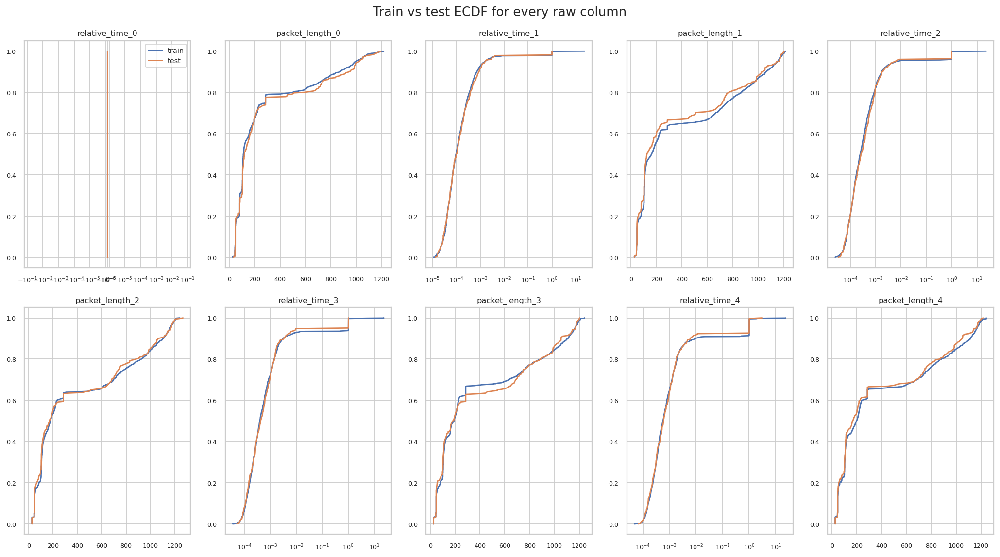

*Train vs test ECDF overlays for the ten raw columns*

Adversarial-validation AUC (train vs test discriminator): **0.529**.

> **Finding.** Adversarial validation AUC is 0.529, close to chance, so train and test are drawn from the same distribution. No covariate-shift correction is needed and cross-validation on the training set is a meaningful proxy for the leaderboard - subject to the call-grouping caveat below.

*Pseudo-group structure used for leakage-aware CV* (`eda/a5_pseudo_groups.csv`)

|                          |       value |
|:-------------------------|------------:|
| n_pseudo_groups          | 1107        |
| largest_group            |   14        |
| rows_in_groups_gt1       |  253        |
| share_rows_in_groups_gt1 |    0.196887 |

> **Finding.** 253 of 1285 training flows (20%) share a near-duplicate signature with at least one other flow. Since the test split comes from held-out calls, plain stratified CV will be optimistic; model selection uses the grouped variant.

## B. Packet-length structure: the codec and transport fingerprint

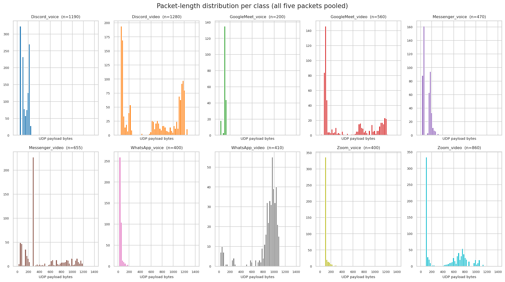

*Packet-length histograms per class*

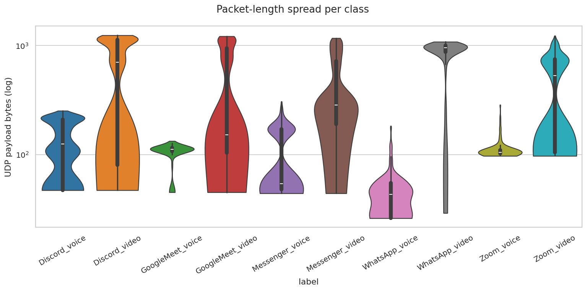

*Per-class packet-length violins on a log axis*

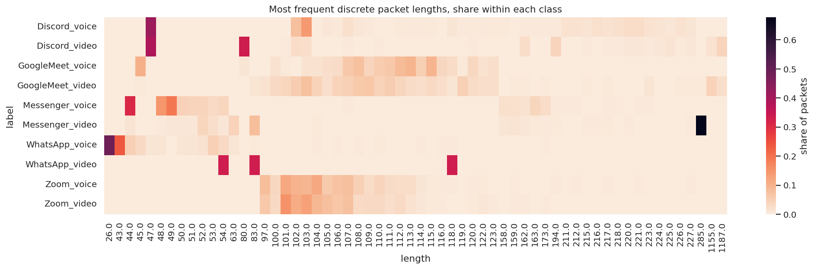

*Discrete packet-length modes per class*

*Share of each frequent length per class* (`eda/b3_length_quantisation.csv`)

| label            |   26.0 |   43.0 |   44.0 |   45.0 |   47.0 |   48.0 |   49.0 |   50.0 |   51.0 |   52.0 |   53.0 |   54.0 |   63.0 |   80.0 |   83.0 |   97.0 |   100.0 |   101.0 |   102.0 |   103.0 |   104.0 |   105.0 |   106.0 |   107.0 |   108.0 |   109.0 |   110.0 |   111.0 |   112.0 |   113.0 |   114.0 |   115.0 |   116.0 |   118.0 |   119.0 |   120.0 |   122.0 |   123.0 |   158.0 |   159.0 |   162.0 |   163.0 |   173.0 |   194.0 |   211.0 |   212.0 |   215.0 |   216.0 |   217.0 |   218.0 |   220.0 |   221.0 |   223.0 |   224.0 |   225.0 |   226.0 |   227.0 |   285.0 |   1155.0 |   1187.0 |
|:-----------------|-------:|-------:|-------:|-------:|-------:|-------:|-------:|-------:|-------:|-------:|-------:|-------:|-------:|-------:|-------:|-------:|--------:|--------:|--------:|--------:|--------:|--------:|--------:|--------:|--------:|--------:|--------:|--------:|--------:|--------:|--------:|--------:|--------:|--------:|--------:|--------:|--------:|--------:|--------:|--------:|--------:|--------:|--------:|--------:|--------:|--------:|--------:|--------:|--------:|--------:|--------:|--------:|--------:|--------:|--------:|--------:|--------:|--------:|---------:|---------:|
| Discord_voice    | 0      | 0      | 0      | 0      | 0.4146 | 0      | 0      | 0      | 0      | 0      | 0      | 0      | 0      | 0      | 0      | 0      |  0      |  0.0013 |  0.0783 |  0.1425 |  0.0013 |  0.009  |  0.0077 |  0.0193 |  0.009  |  0.0039 |  0      |  0      |  0.0064 |  0.0051 |  0.0039 |  0.0064 |  0.0026 |  0.0116 |  0.0051 |  0.0064 |  0.0051 |  0.0077 |  0.0064 |  0.0013 |  0.0051 |  0.0039 |  0.0051 |  0.0039 |  0.018  |  0.0167 |  0.0154 |  0.0193 |  0.0167 |  0.0193 |  0.0244 |  0.0244 |  0.018  |  0.0141 |  0.0103 |  0.018  |  0.0128 |  0      |   0      |   0      |
| Discord_video    | 0      | 0      | 0      | 0      | 0.3888 | 0      | 0      | 0      | 0      | 0      | 0      | 0      | 0      | 0.3347 | 0      | 0      |  0      |  0.004  |  0.0261 |  0.022  |  0      |  0      |  0.002  |  0.004  |  0      |  0.002  |  0.004  |  0      |  0      |  0.002  |  0      |  0      |  0.002  |  0      |  0.002  |  0.004  |  0      |  0      |  0      |  0      |  0.024  |  0      |  0      |  0.0421 |  0.002  |  0.002  |  0.004  |  0      |  0.004  |  0.004  |  0.01   |  0.01   |  0.004  |  0.008  |  0.014  |  0.006  |  0.01   |  0      |   0.018  |   0.0401 |
| GoogleMeet_voice | 0      | 0      | 0      | 0.1034 | 0      | 0      | 0      | 0      | 0      | 0      | 0      | 0      | 0      | 0.0115 | 0      | 0      |  0.0172 |  0.0057 |  0      |  0.0172 |  0.0172 |  0.023  |  0.0287 |  0.0632 |  0.0747 |  0.0402 |  0.0575 |  0.0632 |  0.0862 |  0.0977 |  0.0517 |  0.0977 |  0.0345 |  0.0287 |  0.0057 |  0.0345 |  0.0172 |  0.023  |  0      |  0      |  0      |  0      |  0      |  0      |  0      |  0      |  0      |  0      |  0      |  0      |  0      |  0      |  0      |  0      |  0      |  0      |  0      |  0      |   0      |   0      |
| GoogleMeet_video | 0      | 0      | 0      | 0.0054 | 0      | 0      | 0      | 0      | 0      | 0      | 0      | 0      | 0      | 0      | 0.0108 | 0.0162 |  0.0324 |  0.0378 |  0.0541 |  0.0757 |  0.0432 |  0.0216 |  0.0432 |  0.0486 |  0.0595 |  0.0649 |  0.0432 |  0.0541 |  0.0378 |  0.027  |  0.0216 |  0.0324 |  0.0216 |  0.0108 |  0.0486 |  0.027  |  0.0216 |  0.0216 |  0      |  0.0054 |  0.0054 |  0      |  0.0054 |  0      |  0      |  0      |  0.0054 |  0      |  0.0054 |  0      |  0      |  0      |  0.0108 |  0      |  0      |  0.0054 |  0.0054 |  0.0054 |   0.0432 |   0.0216 |
| Messenger_voice  | 0      | 0      | 0.3088 | 0      | 0      | 0.1474 | 0.193  | 0.0456 | 0.0421 | 0.0421 | 0.0316 | 0.0386 | 0      | 0      | 0      | 0      |  0      |  0      |  0      |  0      |  0      |  0      |  0      |  0.0035 |  0      |  0      |  0      |  0      |  0      |  0      |  0      |  0      |  0      |  0      |  0      |  0      |  0      |  0      |  0.0211 |  0.0211 |  0.0175 |  0.0386 |  0.0246 |  0.0035 |  0.0035 |  0.0035 |  0      |  0      |  0.0035 |  0.0035 |  0      |  0.0035 |  0.0035 |  0      |  0      |  0      |  0      |  0      |   0      |   0      |
| Messenger_video  | 0      | 0      | 0.0158 | 0      | 0      | 0.0032 | 0.0095 | 0.0095 | 0.0095 | 0.0379 | 0.0221 | 0.0095 | 0.0442 | 0      | 0.082  | 0      |  0      |  0      |  0      |  0      |  0.0063 |  0      |  0      |  0      |  0      |  0      |  0      |  0      |  0      |  0      |  0      |  0      |  0      |  0      |  0      |  0      |  0      |  0      |  0.0126 |  0.0158 |  0.0095 |  0.0063 |  0.0032 |  0.0063 |  0      |  0      |  0.0032 |  0.0032 |  0.0063 |  0      |  0.0032 |  0      |  0      |  0      |  0      |  0      |  0.0032 |  0.6782 |   0      |   0      |
| WhatsApp_voice   | 0.4894 | 0.2376 | 0.0496 | 0.0319 | 0.0106 | 0.0106 | 0      | 0.0106 | 0.0106 | 0.0177 | 0.0496 | 0.0319 | 0.0106 | 0      | 0.0071 | 0      |  0      |  0      |  0      |  0      |  0.0035 |  0      |  0.0035 |  0      |  0.0035 |  0      |  0.0071 |  0      |  0      |  0      |  0.0035 |  0      |  0.0035 |  0.0035 |  0      |  0      |  0      |  0      |  0      |  0      |  0      |  0      |  0.0035 |  0      |  0      |  0      |  0      |  0      |  0      |  0      |  0      |  0      |  0      |  0      |  0      |  0      |  0      |  0      |   0      |   0      |
| WhatsApp_video   | 0      | 0      | 0      | 0      | 0      | 0      | 0      | 0      | 0      | 0      | 0      | 0.3333 | 0      | 0      | 0.3333 | 0      |  0      |  0      |  0      |  0      |  0      |  0      |  0      |  0      |  0      |  0      |  0      |  0      |  0      |  0      |  0      |  0      |  0      |  0.3333 |  0      |  0      |  0      |  0      |  0      |  0      |  0      |  0      |  0      |  0      |  0      |  0      |  0      |  0      |  0      |  0      |  0      |  0      |  0      |  0      |  0      |  0      |  0      |  0      |   0      |   0      |
| Zoom_voice       | 0      | 0      | 0      | 0      | 0      | 0      | 0      | 0      | 0      | 0      | 0      | 0      | 0      | 0      | 0      | 0.0812 |  0.0348 |  0.1159 |  0.0986 |  0.0928 |  0.1159 |  0.0609 |  0.0725 |  0.0783 |  0.0493 |  0.029  |  0.0406 |  0.029  |  0.0261 |  0.0261 |  0.0116 |  0.0058 |  0.0029 |  0.0029 |  0      |  0.0029 |  0.0058 |  0      |  0      |  0.0029 |  0      |  0      |  0      |  0.0029 |  0      |  0.0029 |  0      |  0      |  0.0029 |  0      |  0      |  0.0029 |  0      |  0      |  0      |  0      |  0.0029 |  0      |   0      |   0      |
| Zoom_video       | 0      | 0      | 0      | 0      | 0      | 0      | 0      | 0      | 0      | 0      | 0      | 0      | 0      | 0      | 0      | 0.0612 |  0.0321 |  0.1516 |  0.1108 |  0.1283 |  0.0904 |  0.0787 |  0.0641 |  0.0758 |  0.0292 |  0.0321 |  0.0321 |  0.0233 |  0.0292 |  0.0175 |  0.0087 |  0.0058 |  0.0029 |  0      |  0      |  0.0058 |  0.0087 |  0.0029 |  0      |  0.0029 |  0.0029 |  0      |  0.0029 |  0      |  0      |  0      |  0      |  0      |  0      |  0      |  0      |  0      |  0      |  0      |  0      |  0      |  0      |  0      |   0      |   0      |

*Top 20 discrete lengths per class* (`eda/b4_top_lengths.csv`)

| label            | top_lengths(count)                                                                                                                                                                        |
|:-----------------|:------------------------------------------------------------------------------------------------------------------------------------------------------------------------------------------|
| Discord_video    | 47(194), 80(167), 194(21), 1187(20), 1203(13), 102(13), 162(12), 1119(12), 1242(11), 103(11), 612(11), 1180(11), 1163(10), 1167(10), 1200(9), 1099(9), 1139(9), 1192(9), 1155(9), 1142(8) |
| Discord_voice    | 47(323), 103(111), 102(61), 220(19), 221(19), 107(15), 216(15), 218(15), 223(14), 226(14), 211(14), 222(13), 212(13), 217(13), 215(12), 230(11), 224(11), 229(11), 227(10), 213(10)       |
| GoogleMeet_video | 103(14), 109(12), 108(11), 74(11), 102(10), 111(10), 119(9), 107(9), 1155(8), 106(8), 104(8), 110(8), 112(7), 78(7), 101(7), 115(6), 100(6), 1102(6), 945(5), 1114(5)                     |
| GoogleMeet_voice | 45(18), 113(17), 115(17), 112(15), 108(13), 111(11), 107(11), 110(10), 114(9), 117(9), 109(7), 116(6), 120(6), 118(5), 106(5), 123(4), 105(4), 122(3), 104(3), 100(3)                     |
| Messenger_video  | 285(215), 83(26), 63(14), 52(12), 86(9), 161(8), 53(7), 177(6), 160(5), 159(5), 82(5), 44(5), 874(4), 615(4), 1069(4), 1150(4), 1116(4), 158(4), 637(4), 1168(3)                          |
| Messenger_voice  | 44(88), 49(55), 48(42), 50(13), 52(12), 51(12), 163(11), 54(11), 166(9), 165(9), 53(9), 173(7), 158(6), 159(6), 179(6), 185(6), 180(5), 162(5), 157(5), 181(5)                            |
| WhatsApp_video   | 1079(8), 980(7), 985(6), 1028(6), 1000(6), 968(6), 864(5), 913(5), 976(5), 1075(5), 973(5), 969(5), 972(5), 940(4), 900(4), 881(4), 873(4), 944(4), 909(4), 917(4)                        |
| WhatsApp_voice   | 26(138), 43(67), 53(14), 44(14), 55(12), 61(10), 54(9), 46(9), 42(9), 45(9), 58(8), 56(8), 57(7), 30(6), 52(5), 62(5), 41(4), 60(4), 50(3), 63(3)                                         |
| Zoom_video       | 101(52), 103(44), 102(38), 104(31), 105(27), 107(26), 106(22), 97(21), 100(11), 110(11), 109(11), 108(10), 688(10), 750(10), 112(10), 654(9), 986(9), 111(8), 594(8), 868(7)              |
| Zoom_voice       | 101(40), 104(40), 102(34), 103(32), 97(28), 107(27), 106(25), 105(21), 108(17), 110(14), 100(12), 109(10), 111(10), 112(9), 113(9), 114(4), 127(2), 124(2), 141(2), 136(2)                |

*Share of packets per length band* (`eda/b5_band_composition.csv`)

| label            |   tiny(<100B) |   audio(100-300B) |   mid(300-1100B) |    mtu |
|:-----------------|--------------:|------------------:|-----------------:|-------:|
| Discord_voice    |        0.2723 |            0.7277 |           0      | 0      |
| Discord_video    |        0.2836 |            0.1398 |           0.2688 | 0.3078 |
| GoogleMeet_voice |        0.105  |            0.895  |           0      | 0      |
| GoogleMeet_video |        0.175  |            0.3839 |           0.2714 | 0.1696 |
| Messenger_voice  |        0.5298 |            0.466  |           0.0043 | 0      |
| Messenger_video  |        0.1542 |            0.4718 |           0.3237 | 0.0504 |
| WhatsApp_voice   |        0.95   |            0.05   |           0      | 0      |
| WhatsApp_video   |        0.0585 |            0.0244 |           0.9171 | 0      |
| Zoom_voice       |        0.0725 |            0.9275 |           0      | 0      |
| Zoom_video       |        0.0244 |            0.4419 |           0.5256 | 0.0081 |

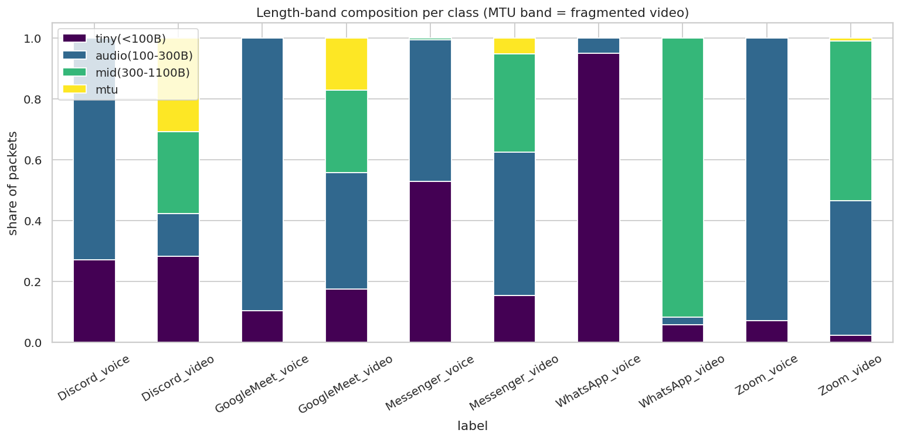

*Length-band composition per class*

> **Finding.** Packets in the 1100-1600 B path-MTU band make up 10.7% of video-class packets against 0.0% for voice classes: MTU-regime fragmentation is a direct video marker and motivates the frac_mtu / n_mtu features.

*Mean packet length by position in flow* (`eda/b6_mean_length_by_index.csv`)

| label            |     0 |     1 |     2 |     3 |     4 |
|:-----------------|------:|------:|------:|------:|------:|
| Discord_video    | 215.7 | 674.3 | 754.1 | 701.9 | 766.9 |
| Discord_voice    | 119.4 | 124.9 | 137.7 | 150   | 150.9 |
| GoogleMeet_video | 446.2 | 488.1 | 466.9 | 503.1 | 488.7 |
| GoogleMeet_voice | 106.6 |  95.7 | 111.2 | 107.2 | 112.6 |
| Messenger_video  | 266.6 | 520.1 | 526.4 | 454   | 447.6 |
| Messenger_voice  | 122.5 | 105.5 | 114.7 | 109.3 |  99.6 |
| WhatsApp_video   | 848   | 903.4 | 904.4 | 877.2 | 843.5 |
| WhatsApp_voice   |  43.9 |  58.4 |  48.4 |  43.9 |  38.7 |
| Zoom_video       | 446.8 | 449.2 | 460.7 | 449.2 | 457.6 |
| Zoom_voice       | 121.8 | 116.4 | 112.8 | 111.6 | 111.6 |

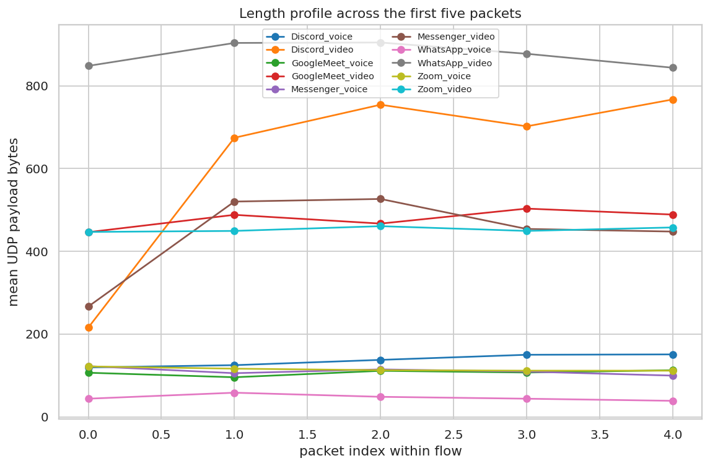

*Mean packet length by position, per class*

*Flows whose five packets share one length* (`eda/b7_constant_flows.csv`)

| label            |   constant_length_flows |   total_flows |   share |
|:-----------------|------------------------:|--------------:|--------:|
| Discord_voice    |                      58 |           238 |   0.244 |
| Discord_video    |                      37 |           256 |   0.145 |
| GoogleMeet_voice |                       0 |            40 |   0     |
| GoogleMeet_video |                       2 |           112 |   0.018 |
| Messenger_voice  |                       1 |            94 |   0.011 |
| Messenger_video  |                       4 |           131 |   0.031 |
| WhatsApp_voice   |                       5 |            80 |   0.062 |
| WhatsApp_video   |                       0 |            82 |   0     |
| Zoom_voice       |                       1 |            80 |   0.012 |
| Zoom_video       |                      17 |           172 |   0.099 |

> **Finding.** Constant-size flows (keepalive/STUN-like, frequently 47 B) are concentrated in the Discord classes (58 voice, 37 video). They are a flow type rather than an application signature, so they are flagged explicitly (is_constant_keepalive) instead of being learned implicitly.

## C. Timing structure: the pacing fingerprint

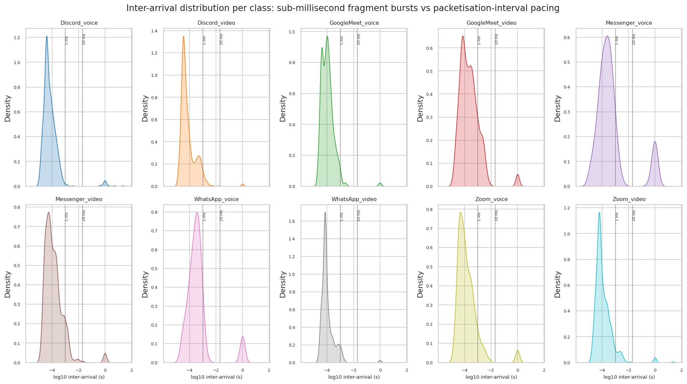

*Per-class inter-arrival KDEs on a log scale*

*Share of sub-millisecond and >20 ms gaps* (`eda/c2_burstiness.csv`)

| label            |   sub_ms |   over_20ms |   median_iat_s |
|:-----------------|---------:|------------:|---------------:|
| Discord_voice    |   0.9779 |      0.0179 |         0.0001 |
| Discord_video    |   0.9658 |      0.0049 |         0      |
| GoogleMeet_voice |   0.9812 |      0.0062 |         0.0001 |
| GoogleMeet_video |   0.8415 |      0.0179 |         0.0002 |
| Messenger_voice  |   0.8245 |      0.1117 |         0.0003 |
| Messenger_video  |   0.9141 |      0.0172 |         0.0001 |
| WhatsApp_voice   |   0.8875 |      0.0656 |         0.0003 |
| WhatsApp_video   |   0.9543 |      0.0061 |         0.0001 |
| Zoom_voice       |   0.9062 |      0.025  |         0.0001 |
| Zoom_video       |   0.9375 |      0.0116 |         0.0001 |

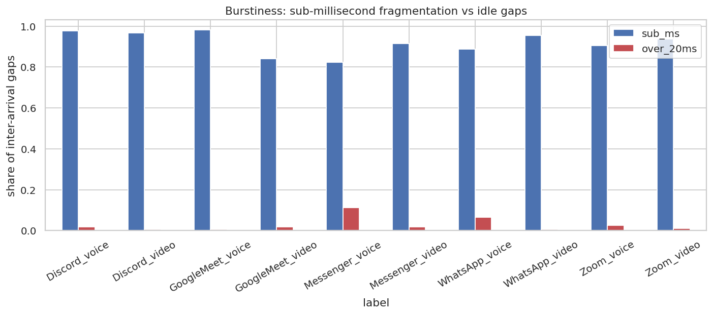

*Sub-millisecond and long-gap shares per class*

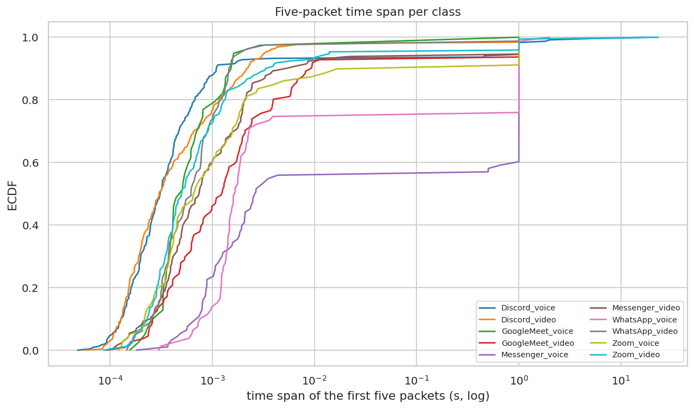

*Flow-duration ECDF per class*

*Five-packet time span* (`eda/c3_duration_stats.csv`)

| label            |   count |     mean |      std |      min |      10% |      50% |      90% |      99% |      max |
|:-----------------|--------:|---------:|---------:|---------:|---------:|---------:|---------:|---------:|---------:|
| Discord_voice    |     238 | 0.180433 | 1.5474   | 4.8e-05  | 0.000128 | 0.000309 | 0.001095 | 1.93939  | 23.0715  |
| Discord_video    |     256 | 0.020268 | 0.138471 | 5.7e-05  | 0.000129 | 0.000303 | 0.002187 | 0.999077 |  1.00149 |
| GoogleMeet_voice |      40 | 0.025719 | 0.15837  | 0.000155 | 0.000263 | 0.000476 | 0.001523 | 0.61254  |  1.00229 |
| GoogleMeet_video |     112 | 0.073489 | 0.25891  | 9.1e-05  | 0.00026  | 0.001235 | 0.009237 | 1.00552  |  1.00988 |
| Messenger_voice  |      94 | 0.42402  | 0.489383 | 0.000181 | 0.000695 | 0.002613 | 1.00405  | 1.00661  |  1.00702 |
| Messenger_video  |     131 | 0.062511 | 0.240487 | 9.8e-05  | 0.000246 | 0.000742 | 0.005214 | 1.00299  |  1.00404 |
| WhatsApp_voice   |      80 | 0.264451 | 0.471329 | 0.000298 | 0.000758 | 0.001641 | 1.0032   | 1.21574  |  2.00634 |
| WhatsApp_video   |      82 | 0.02509  | 0.15499  | 0.000145 | 0.000256 | 0.00062  | 0.001456 | 0.998194 |  1.00116 |
| Zoom_voice       |      80 | 0.10144  | 0.302051 | 0.000122 | 0.000217 | 0.000658 | 0.114891 | 1.00259  |  1.0032  |
| Zoom_video       |     172 | 0.176744 | 1.77731  | 8.7e-05  | 0.000231 | 0.000499 | 0.003324 | 1.00285  | 23.2058  |

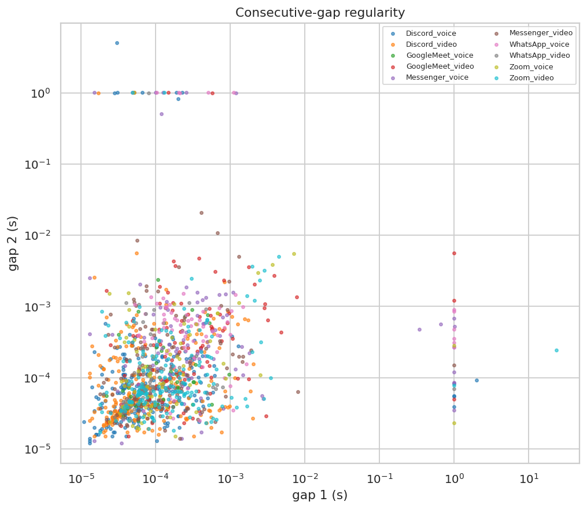

*First versus second inter-arrival gap, coloured by class*

> **Finding.** Video classes concentrate their gaps below one millisecond (packets of a single frame fragmented across the MTU) while voice classes carry a heavier mass near the packetisation interval and in the idle tail, which is what the burst/frame-group feature block (F6) is built to capture.

## D. Joint size-timing structure

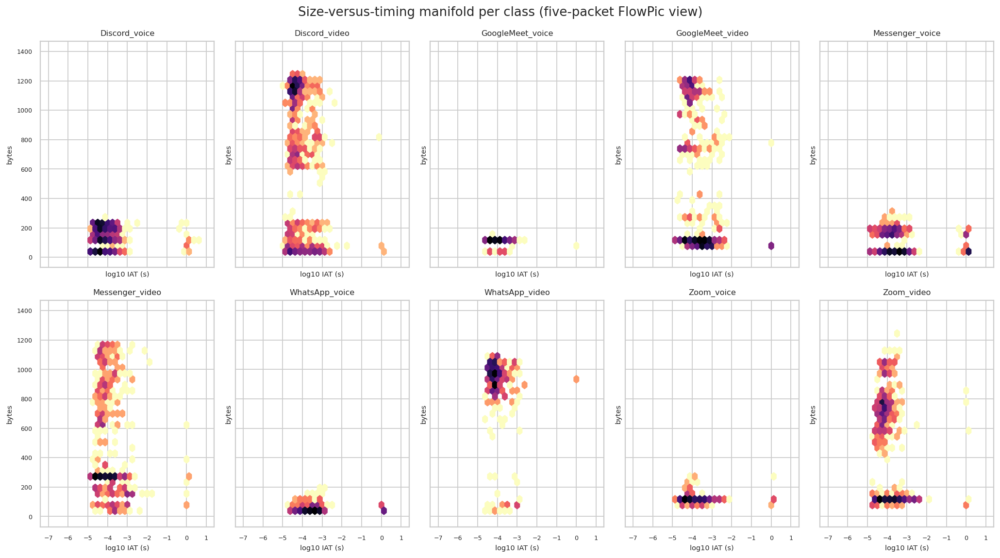

*Joint packet-size / inter-arrival density per class*

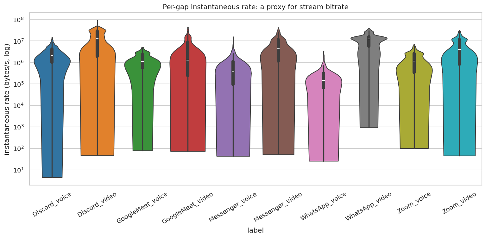

*Instantaneous per-gap rate per class*

*Instantaneous rate summary* (`eda/d2_instantaneous_rate.csv`)

| label            |   count |             mean |              std |   min |              50% |         max |
|:-----------------|--------:|-----------------:|-----------------:|------:|-----------------:|------------:|
| Discord_voice    |     952 |      2.94604e+06 |      2.68585e+06 |   4.5 |      2.10175e+06 | 1.475e+07   |
| Discord_video    |    1024 |      1.62431e+07 |      1.52423e+07 |  47   |      1.30964e+07 | 8.97692e+07 |
| GoogleMeet_voice |     160 |      1.46876e+06 |      1.15478e+06 |  78.9 |      1.10205e+06 | 5.13636e+06 |
| GoogleMeet_video |     448 |      5.99276e+06 |      9.09463e+06 |  73.8 |      1.26042e+06 | 4.3963e+07  |
| Messenger_voice  |     376 |      1.08334e+06 |      2.04246e+06 |  43.9 | 393150           | 1.56923e+07 |
| Messenger_video  |     524 |      7.44641e+06 |      8.32263e+06 |  51.9 |      4.2177e+06  | 4.17308e+07 |
| WhatsApp_voice   |     320 | 313034           | 494610           |  25.9 | 146978           | 3.4e+06     |
| WhatsApp_video   |     328 |      1.21617e+07 |      8.41322e+06 | 932.6 |      1.24603e+07 | 3.78889e+07 |
| Zoom_voice       |     320 |      1.57736e+06 |      1.46829e+06 | 100.9 |      1.14837e+06 | 7.2e+06     |
| Zoom_video       |     688 |      6.75133e+06 |      6.94732e+06 |  45.3 |      4.00742e+06 | 3.09412e+07 |

## E. Class separability and the actual hard pairs

*Feature ranking by mutual information* (`eda/e1_feature_ranking.csv`)

| feature                 |   mutual_info |   anova_f |
|:------------------------|--------------:|----------:|
| len_min                 |        1.2709 |   77.5896 |
| len_4                   |        1.177  |  115.716  |
| len_q25                 |        1.1657 |   87.2653 |
| log_len_4               |        1.1615 |  119.12   |
| log_len_3               |        1.1548 |  107.307  |
| len_3                   |        1.1527 |  100.889  |
| len_0                   |        1.1467 |   98.3645 |
| len_q75                 |        1.1463 |  158.057  |
| log_len_0               |        1.1395 |   95.6894 |
| len_max                 |        1.1317 |  181.586  |
| len_median              |        1.1274 |  130.351  |
| len_1                   |        1.0671 |  108.645  |
| log_len_2               |        1.0617 |  122.221  |
| log_len_1               |        1.0578 |  105.642  |
| len_2                   |        1.0559 |  121.859  |
| rtp_payload_mean        |        1.0078 |  149.923  |
| len_fftmag_0            |        1.0055 |  149.922  |
| len_dct_0               |        1.0007 |  149.923  |
| total_bytes             |        1.0001 |  149.922  |
| len_sum                 |        0.9992 |  149.922  |
| srtp_payload_mean       |        0.9966 |  149.923  |
| len_mean                |        0.9963 |  149.923  |
| group_max_bytes_20000us |        0.923  |  148.727  |
| group_max_bytes_5000us  |        0.9217 |  148.914  |
| group_max_bytes_1000us  |        0.9    |  136.64   |
| group_max_bytes_500us   |        0.8881 |  120.172  |
| len_range               |        0.7768 |  137.943  |
| len_ratio_02            |        0.7537 |   63.5559 |
| len_over_first_2        |        0.7472 |   63.5559 |
| len_over_first_1        |        0.7464 |   61.4442 |

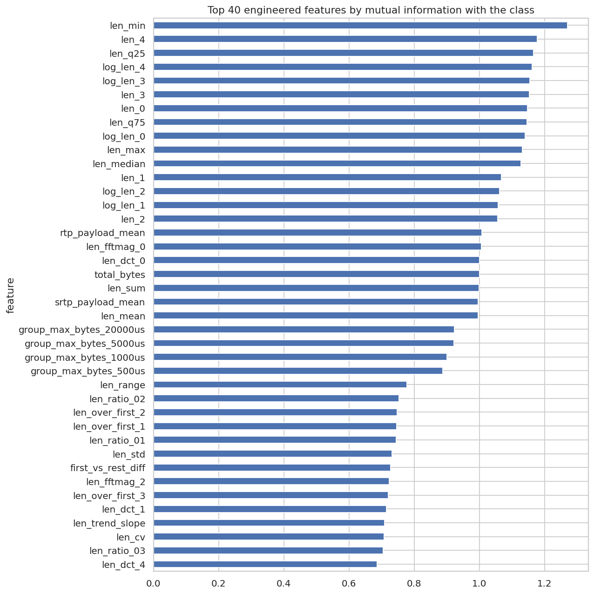

*Mutual information of engineered features with the label*

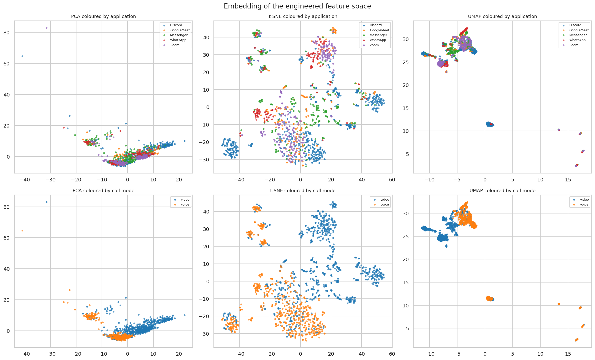

*PCA / t-SNE / UMAP coloured by application and by call mode*

*Baseline LightGBM confusion matrix (acc=0.810)* (`eda/e3_baseline_confusion.csv`)

|                  |   Discord_voice |   Discord_video |   GoogleMeet_voice |   GoogleMeet_video |   Messenger_voice |   Messenger_video |   WhatsApp_voice |   WhatsApp_video |   Zoom_voice |   Zoom_video |
|:-----------------|----------------:|----------------:|-------------------:|-------------------:|------------------:|------------------:|-----------------:|-----------------:|-------------:|-------------:|
| Discord_voice    |             217 |               6 |                  2 |                  0 |                 5 |                 0 |                0 |                0 |            3 |            5 |
| Discord_video    |              26 |             213 |                  0 |                  4 |                 3 |                 4 |                0 |                3 |            0 |            3 |
| GoogleMeet_voice |               3 |               0 |                 31 |                  3 |                 1 |                 0 |                0 |                0 |            1 |            1 |
| GoogleMeet_video |               2 |               3 |                  7 |                 77 |                 1 |                 6 |                0 |                3 |            5 |            8 |
| Messenger_voice  |               6 |               1 |                  0 |                  0 |                87 |                 0 |                0 |                0 |            0 |            0 |
| Messenger_video  |               0 |               9 |                  0 |                  5 |                 5 |               108 |                0 |                4 |            0 |            0 |
| WhatsApp_voice   |               1 |               0 |                  0 |                  0 |                 0 |                 0 |               79 |                0 |            0 |            0 |
| WhatsApp_video   |               0 |               4 |                  0 |                  1 |                 0 |                 4 |                0 |               73 |            0 |            0 |
| Zoom_voice       |               8 |               0 |                  1 |                  2 |                 0 |                 1 |                0 |                0 |           32 |           36 |
| Zoom_video       |               4 |               2 |                  1 |                  5 |                 0 |                 1 |                0 |                0 |           35 |          124 |

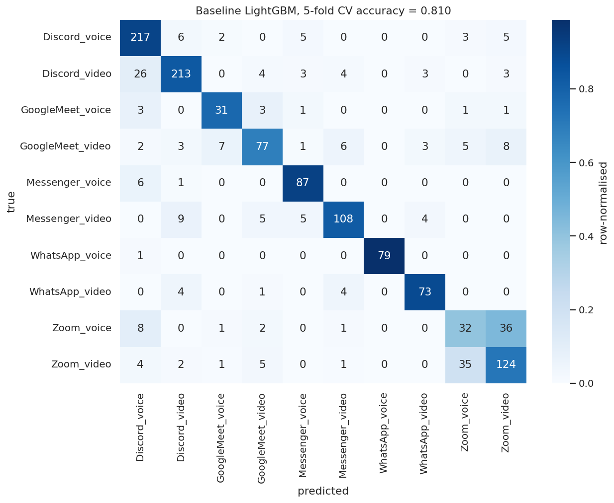

*Baseline confusion matrix on engineered features*

*Most frequent confusions* (`eda/e4_hard_pairs.csv`)

|    | true             | predicted        |   count |
|---:|:-----------------|:-----------------|--------:|
|  0 | Zoom_voice       | Zoom_video       |      36 |
|  1 | Zoom_video       | Zoom_voice       |      35 |
|  2 | Discord_video    | Discord_voice    |      26 |
|  3 | Messenger_video  | Discord_video    |       9 |
|  4 | Zoom_voice       | Discord_voice    |       8 |
|  5 | GoogleMeet_video | Zoom_video       |       8 |
|  6 | GoogleMeet_video | GoogleMeet_voice |       7 |
|  7 | GoogleMeet_video | Messenger_video  |       6 |
|  8 | Messenger_voice  | Discord_voice    |       6 |
|  9 | Discord_voice    | Discord_video    |       6 |

> **Finding.** A plain LightGBM on the engineered features already reaches 0.810 accuracy in 5-fold CV. The dominant confusion is Zoom_voice -> Zoom_video (36 flows), so feature work and ensembling should be judged on whether they move that pair rather than on overall accuracy alone.

*Flat versus factorised targets* (`eda/e5_hierarchical.csv`)

| target          |   cv_accuracy |
|:----------------|--------------:|
| flat 10-class   |        0.8101 |
| application (5) |        0.9121 |
| call mode (2)   |        0.8879 |
| product bound   |        0.8099 |

> **Finding.** Call mode is nearly free to predict (0.888) while the application is the hard half (0.912). The independent-product bound (0.810) sits below the flat model (0.810), so the hierarchical decomposition is kept as an ensemble member and judged on grouped CV.

## F. Class imbalance and the flows-per-call prior

*Flows per source call and the implied test prior* (`eda/f1_class_prior.csv`)

| label            |   train_flows |   source_calls |   flows_per_call |   implied_test_flows |   implied_test_share |
|:-----------------|--------------:|---------------:|-----------------:|---------------------:|---------------------:|
| Discord_voice    |           238 |             40 |            5.95  |                59.5  |                0.185 |
| Discord_video    |           256 |             40 |            6.4   |                64    |                0.199 |
| GoogleMeet_voice |            40 |             40 |            1     |                10    |                0.031 |
| GoogleMeet_video |           112 |             40 |            2.8   |                28    |                0.087 |
| Messenger_voice  |            94 |             40 |            2.35  |                23.5  |                0.073 |
| Messenger_video  |           131 |             40 |            3.275 |                32.75 |                0.102 |
| WhatsApp_voice   |            80 |             40 |            2     |                20    |                0.062 |
| WhatsApp_video   |            82 |             40 |            2.05  |                20.5  |                0.064 |
| Zoom_voice       |            80 |             40 |            2     |                20    |                0.062 |
| Zoom_video       |           172 |             40 |            4.3   |                43    |                0.134 |

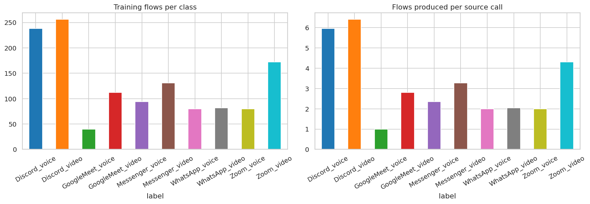

*Class counts and the flows-per-call ratio*

> **Finding.** Per-class flow counts vary 6.4x because applications differ in how many UDP flows one call opens (1.0 to 6.4 flows per call). Extrapolating that ratio to the 100 held-out test calls predicts about 321 test flows against the 327 actually supplied, so the prior is a useful sanity check on the submitted class distribution but not a hard constraint.
