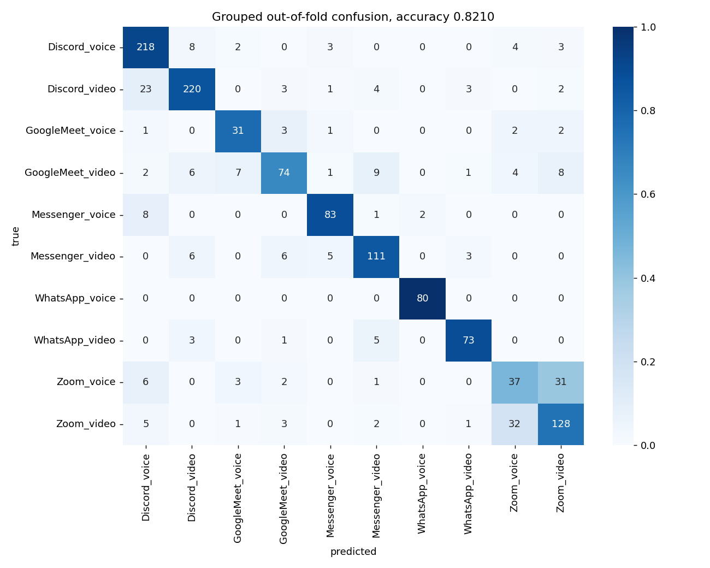
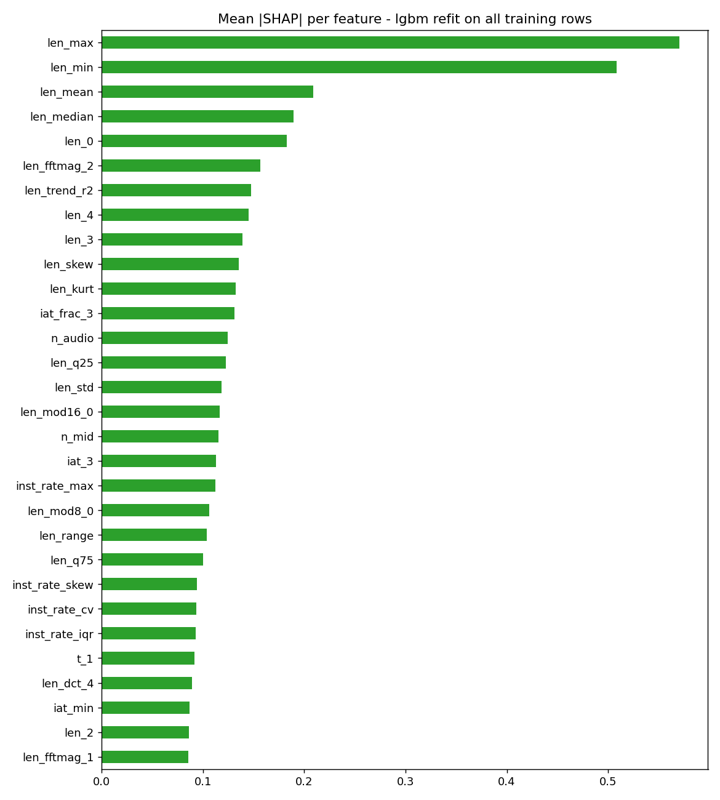

# Model card - encrypted RTC application identification

## Task

Ten-class classification (5 applications x 2 call modes) from the sizes and inter-arrival times of the first 5 packets of an encrypted UDP media flow. 1285 labelled training flows, 327 test flows.


## Validation protocol

- `plain`: repeated stratified 5-fold, the optimistic estimate.
- `group`: stratified group 5-fold over a pseudo-group key that keeps near-duplicate flows together. The competition test split comes from held-out source calls and no call identifier is published, so this is the decisive number and every model is selected on it.


## Search record

Points scored: **2377** across 12 model families.


### Best point per model family

| model          | features   | target_feats   |   group_acc |   plain_acc |   group_macro_f1 | params                                                                                                                                                                                                                                                                     |
|:---------------|:-----------|:---------------|------------:|------------:|-----------------:|:---------------------------------------------------------------------------------------------------------------------------------------------------------------------------------------------------------------------------------------------------------------------------|
| lgbm           | full       | False          |      0.8249 |    nan      |           0.8069 | {"class_weight_mode": "none", "colsample_bytree": 0.8, "learning_rate": 0.12, "min_child_samples": 10, "n_estimators": 800, "num_leaves": 31, "reg_lambda": 0.0, "subsample": 0.8, "subsample_freq": 1}                                                                    |
| xgb            | full       | False          |      0.8218 |    nan      |           0.8067 | {"class_weight_mode": "balanced", "colsample_bytree": 0.8, "learning_rate": 0.12, "max_depth": 6, "min_child_weight": 1, "n_estimators": 800, "reg_lambda": 1.0, "subsample": 0.9}                                                                                         |
| hgb            | full       | False          |      0.8156 |    nan      |           0.7959 | {"l2_regularization": 0.0, "learning_rate": 0.1, "max_iter": 400, "max_leaf_nodes": 31, "min_samples_leaf": 5}                                                                                                                                                             |
| et             | full       | False          |      0.8125 |    nan      |           0.8009 | {"class_weight_mode": "none", "max_depth": null, "max_features": 0.3, "min_samples_leaf": 1, "n_estimators": 600}                                                                                                                                                          |
| cat            | full       | False          |      0.807  |    nan      |           0.7895 | {"class_weight_mode": "balanced", "depth": 4, "iterations": 1000, "l2_leaf_reg": 1.0, "learning_rate": 0.08}                                                                                                                                                               |
| rf             | full       | True           |      0.8023 |    nan      |           0.7866 | {"class_weight_mode": "balanced_subsample", "max_depth": 32, "max_features": 0.13964877567667833, "min_samples_leaf": 2, "min_samples_split": 6, "n_estimators": 800}                                                                                                      |
| tfm_pretrained | sequence   | False          |      0.7346 |      0.7401 |           0.7262 | {"augment": true, "batch_size": 64, "class_weighted": false, "d_model": 96, "dim_ff": 192, "dropout": 0.15, "epochs": 140, "label_smoothing": 0.05, "lr": 0.0015, "mixup_alpha": 0.4, "mixup_prob": 0.5, "n_heads": 4, "n_layers": 3, "swa_last": 5, "weight_decay": 0.05} |
| tfm_scratch    | sequence   | False          |      0.7331 |      0.7276 |           0.7239 | {"augment": true, "batch_size": 64, "class_weighted": false, "d_model": 96, "dim_ff": 192, "dropout": 0.15, "epochs": 140, "label_smoothing": 0.05, "lr": 0.0015, "mixup_alpha": 0.4, "mixup_prob": 0.5, "n_heads": 4, "n_layers": 3, "swa_last": 5, "weight_decay": 0.05} |
| mlp            | full       | False          |      0.7292 |    nan      |           0.6792 | {"alpha": 0.01, "hidden_layer_sizes": [256, 128], "learning_rate_init": 0.003}                                                                                                                                                                                             |
| svm            | full       | False          |      0.7268 |    nan      |           0.6595 | {"C": 10.0, "class_weight_mode": "balanced", "gamma": "scale"}                                                                                                                                                                                                             |
| logreg         | full       | False          |      0.7144 |    nan      |           0.6666 | {"C": 0.3, "class_weight_mode": "none"}                                                                                                                                                                                                                                    |
| knn            | full       | True           |      0.7132 |      0.7209 |           0.6747 | {"n_neighbors": 5, "weights": "distance"}                                                                                                                                                                                                                                  |


Cumulative fitting time across all scored points: **83.6 container-hours**, executed in parallel across Modal containers.


## Error analysis of the selected model

Source: `lgbm_7585cc52`, grouped out-of-fold accuracy 0.8210.


### Per-class performance

|                  |   precision |   recall |   f1-score |   support |
|:-----------------|------------:|---------:|-----------:|----------:|
| Discord_voice    |       0.829 |    0.916 |      0.87  |       238 |
| Discord_video    |       0.905 |    0.859 |      0.882 |       256 |
| GoogleMeet_voice |       0.705 |    0.775 |      0.738 |        40 |
| GoogleMeet_video |       0.804 |    0.661 |      0.725 |       112 |
| Messenger_voice  |       0.883 |    0.883 |      0.883 |        94 |
| Messenger_video  |       0.835 |    0.847 |      0.841 |       131 |
| WhatsApp_voice   |       0.976 |    1     |      0.988 |        80 |
| WhatsApp_video   |       0.901 |    0.89  |      0.896 |        82 |
| Zoom_voice       |       0.468 |    0.462 |      0.465 |        80 |
| Zoom_video       |       0.736 |    0.744 |      0.74  |       172 |





Dominant confusions: Zoom_video -> Zoom_voice (32); Zoom_voice -> Zoom_video (31); Discord_video -> Discord_voice (23); GoogleMeet_video -> Messenger_video (9); Discord_voice -> Discord_video (8); Messenger_voice -> Discord_voice (8).


## Ensemble

Winner: **single_best** at 0.8210 on the honest estimate (weights fitted on four fifths of the out-of-fold rows and scored on the fifth).

| combiner                        |   score |
|:--------------------------------|--------:|
| single best                     |  0.821  |
| hill-climb (nested)             |  0.8195 |
| hill-climb (fitted, optimistic) |  0.8319 |
| rank average                    |  0.7735 |
| stacking (nested)               |  0.8187 |


### Blend weights

|               |   weight |
|:--------------|---------:|
| lgbm_7585cc52 |     0.25 |
| lgbm_8e745458 |     0.25 |
| xgb_8cd01741  |     0.25 |
| hgb_b27ab344  |     0.25 |


## Auxiliary corpus and linear probes

```json
{
  "aux_flows": 90610,
  "checkpoint": "/cache/pretrain/encoder.pt",
  "p1_train_acc": 0.5003310892837435,
  "p1_classes": [
    "Discord",
    "Skype",
    "Zoom",
    "Teams",
    "Messenger",
    "Twitch",
    "Slack",
    "Meet",
    "Webex",
    "Crunchyroll",
    "GotoMeeting",
    "Telegram",
    "Trueconf",
    "Omlet",
    "Signal",
    "JitsiMeet",
    "Line",
    "WhatsApp",
    "ClashRoyale",
    "KakaoTalk"
  ],
  "p2_train_acc": 0.9956848030018761,
  "p3_log_bitrate_r2": 0.9475095367338164,
  "p3_log_mean_gap_r2": 0.9534666121767517,
  "p3_frac_mtu_r2": 0.9500128500880778,
  "p5_explained_variance": 0.964198112487793,
  "n_probe_features": 46
}
```


## Submitted class distribution vs the flows-per-call prior

| label            |   predicted_flows |   predicted_share |   prior_share |   ratio |
|:-----------------|------------------:|------------------:|--------------:|--------:|
| Discord_voice    |                70 |            0.2141 |        0.1852 |   1.156 |
| Discord_video    |                59 |            0.1804 |        0.1992 |   0.906 |
| GoogleMeet_voice |                 9 |            0.0275 |        0.0311 |   0.884 |
| GoogleMeet_video |                22 |            0.0673 |        0.0872 |   0.772 |
| Messenger_voice  |                23 |            0.0703 |        0.0732 |   0.962 |
| Messenger_video  |                35 |            0.107  |        0.1019 |   1.05  |
| WhatsApp_voice   |                19 |            0.0581 |        0.0623 |   0.933 |
| WhatsApp_video   |                22 |            0.0673 |        0.0638 |   1.054 |
| Zoom_voice       |                19 |            0.0581 |        0.0623 |   0.933 |
| Zoom_video       |                49 |            0.1498 |        0.1339 |   1.119 |


## Reproduction

```
modal run src/modal_app.py::seed
modal run src/modal_app.py::eda
modal run src/modal_app.py::features
modal run --detach src/modal_app.py::search --stage all_trees
modal run --detach src/modal_app.py::optuna_search --model lgbm --trials 200
modal run --detach src/modal_app.py::aux_ingest
modal run --detach src/modal_app.py::pretrain
modal run src/modal_app.py::probes --pretrained /cache/pretrain/encoder.pt
modal run src/modal_app.py::finalists
modal run src/modal_app.py::ensemble
modal run src/modal_app.py::submit
```

## What the selected model actually uses

|                |   mean_abs_shap |
|:---------------|----------------:|
| len_max        |          0.5701 |
| len_min        |          0.5083 |
| len_mean       |          0.2087 |
| len_median     |          0.1897 |
| len_0          |          0.1828 |
| len_fftmag_2   |          0.1565 |
| len_trend_r2   |          0.1475 |
| len_4          |          0.1449 |
| len_3          |          0.1393 |
| len_skew       |          0.1356 |
| len_kurt       |          0.1324 |
| iat_frac_3     |          0.131  |
| n_audio        |          0.1245 |
| len_q25        |          0.1224 |
| len_std        |          0.1187 |
| len_mod16_0    |          0.1167 |
| n_mid          |          0.1154 |
| iat_3          |          0.1129 |
| inst_rate_max  |          0.1125 |
| len_mod8_0     |          0.1062 |
| len_range      |          0.1039 |
| len_q75        |          0.1003 |
| inst_rate_skew |          0.094  |
| inst_rate_cv   |          0.0932 |
| inst_rate_iqr  |          0.093  |
| t_1            |          0.0914 |
| len_dct_4      |          0.0891 |
| iat_min        |          0.0867 |
| len_2          |          0.0859 |
| len_fftmag_1   |          0.0857 |


